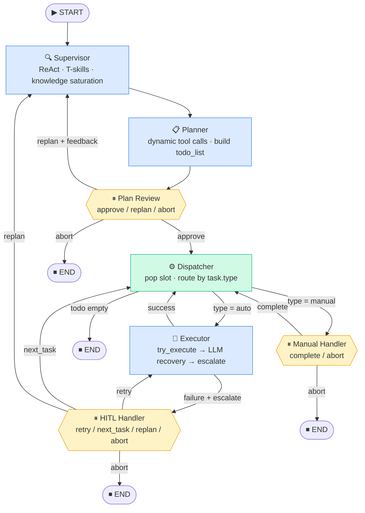

# CLAUDE.md — LLM-Driven Industrial Robot Assembly System

本文件是 Claude Code 的行为规范与项目约定。**每次开始任务前必须阅读本文件。**

---

## 项目一句话描述

接收自然语言装配指令，通过多智能体状态机驱动机器人完成工业装配；在能力边界处强制挂起交由人工介入，绝不幻觉。

---

## 语言

----
交流时输出中文，代码注释一律用英文

----

## 开发和规范原则

---
- 当发现原文档的设计有问题时或与你探讨出有问题时，应在许可后将发现更新至文档并修改原来的表述，但是不要直接替换以保留迭代过程。
- 在规划时思考隐藏的逻辑问题，包括但不限于造成逻辑死锁的设计、兜底过多导致过度静默处理错误都应避免。
- **禁止在 `SkiLib/` 生产代码中使用 `print()`**，一律通过 `SkiLib/log.py` 提供的 `get_logger(__name__)` 获取模块级 logger 输出。Logger 配置双 Handler（控制台 StreamHandler + 轮转文件 RotatingFileHandler），行为与 print 等价但支持级别过滤和持久化。Notebook 实验代码不受此约束。`SkiLib/log.py` 已实现（2026-03-17）。
- **实现完毕的功能必须同步更新文档**，包括 CLAUDE.md 目录结构、IMPLEMENTATION_CHECKLIST.md 对应条目、以及 ARCHITECTURE.md 中的状态标注。未更新文档的实现视为不完整。
- **开发前必须激活虚拟环境**：运行 Notebook、执行脚本、调试 SkiLib 或启动 Agent 前，须先激活项目虚拟环境（如 `conda activate <env>` 或 `.venv\Scripts\activate`）。未激活环境直接运行可能导致依赖缺失或版本冲突，且错误现象不易排查。
---


## 技术栈

| 组件 | 选型 |
|------|------|
| Agent 编排 | LangGraph (`StateGraph`) |
| LLM 基础设施 | LangChain Core |
| 大模型 | **Claude** 强能力验证模型 + **本地 LLM**（如 ChatOllama / Llama-3.1） |
| 机器人仿真 | **Genesis**（`genesis-world`，UR16e + Robotiq 2F-85） |
| 工艺知识库 | 当前主要来自 prompt / 场景符号；YAML / RAG 为后续扩展 |
| 语言 | Python 3.11+ |

---

## 目录结构

> 最后更新：2026-05-06（Genesis 迁移主路径完成，Phase 7 文档/依赖清理中）

```
RoboSkiAgent/
├── CLAUDE.md
├── IMPLEMENTATION_CHECKLIST.md
├── Agent/                          # Agent 编排层（生产代码）；依赖 SkiLib，单向依赖
│   ├── __init__.py                 # 重新导出 build_graph / make_initial_state / GlobalState
│   ├── state.py                    # GlobalState TypedDict（todo_list / current_task / halt_flag / ...）
│   ├── llm.py                      # LLM 工厂：ROBOSKI_LLM_PROVIDER=claude（默认）/ ollama
│   ├── graph.py                    # build_graph() / make_initial_state()；含 MemorySaver + JsonPlusSerializer
│   ├── gui.py                      # Gradio GUI：完整 interrupt 处理（plan_review / hitl / manual）✅
│   ├── __main__.py                 # CLI 入口：python -m Agent "<指令>"
│   │                               #   ⚠️ 使用 graph.invoke()，遇 interrupt 节点会抛 NodeInterrupt
│   │                               #   含人工审批的完整流程请改用 GUI
│   ├── prompts/                    # 提示词模板（纯文本，运行时 .format() 注入）
│   │   ├── supervisor.txt
│   │   ├── planner.txt
│   │   └── executor.txt
│   ├── nodes/                      # 各节点独立模块
│   │   ├── __init__.py
│   │   ├── supervisor.py           # T-skills 查询 + SupervisorOutput 结构化输出
│   │   ├── planner.py              # 动态生成 add_<Skill>_task 工具，LLM tool-call 构建 todo_list
│   │   ├── plan_review.py          # interrupt 审批门（approve / replan / abort）
│   │   ├── dispatcher.py           # 纯代码槽位填充；manual 任务设 halt_flag
│   │   ├── executor.py             # try_execute + LLM 恢复循环 + _EscalateHITLException 升级
│   │   ├── manual_handler.py       # interrupt：complete / abort
│   │   └── hitl_handler.py         # interrupt：retry / next_task / replan / abort
│   └── notebooks/                  # 历史实验 Notebook（参考用，核心逻辑已迁移）
│       ├── langchain_rag.ipynb     # RAG 实验
│       ├── LangGraph.ipynb         # 早期图流转探索（已过期）
│       └── graph_test.ipynb        # 原始实现参考（2026-03-27，已被 Agent/ 包取代）
└── SkiLib/                         # 纯技能库（无 LangGraph 依赖，可独立测试）
    ├── ARCHITECTURE.md
    ├── __init__.py
    ├── base.py                     # 核心抽象：BasePrimitive / BaseSkill / SkillResult / as_tools() / TOOL_METHODS
    ├── robotcontext.py             # Genesis runtime facade；保留 RobotContext 类名减少上层改动
    ├── registry.py                 # SkillRegistry 单例：反射扫描 skills/，实例化 BaseSkill，暴露 get_tools()
    ├── log.py                      # Logger 工厂：get_logger(__name__)，双 Handler（控制台 + 轮转文件）
    ├── main.py                     # 技能库调试入口（非生产，独立于 Agent 编排）
    ├── genesis/                    # Genesis 后端实现：scene/runtime/controller/motion/types
    │   ├── config.py               # 可调参数：PLACEMENT_XY_TOL_M / PLACEMENT_Z_TOL_M（放置验证容差）
    │   ├── scene.py                # build_genesis_scene(): UR16e + Robotiq + 零件 + 目标点
    │   ├── runtime.py              # GenesisRuntime：scene、objects、targets、tools、reset()、get_object_position()
    │   ├── motion.py               # IK、插值、PD 控制辅助
    │   ├── controller.py           # viewer/macOS 下 scene.step() 单线程序列化器
    │   └── types.py                # TargetPose / SceneTarget / SceneObject
    ├── graph.py                    # ⚠️ 错位历史文件：含 LangGraph 依赖，违反 SkiLib 无 LangGraph 约束；
    │                               #   待迁移至 Agent/notebooks/ 或正式采纳后移入 Agent/graph.py
    ├── RDK_Test.py                 # legacy RoboDK 参考/历史实验
    ├── utils.py
    ├── skill_loader.py             # SkillMdLoader 单例：解析 skills/*.md，生成 Pydantic schema，供 Planner V2 / Executor V2 使用
    ├── metatools/                  # T-skills：Supervisor 使用的只读场景查询工具（规划时，无坐标，只返回符号名）
    │   ├── __init__.py
    │   └── informative.py          # list_targets / list_objects / list_tools / check_item_exists / get_gripper_state
    ├── sensors/                    # 执行时物理感知传感器：Executor V2 plan check / recovery 使用（可返回物理量）
    │   ├── __init__.py             # SensorRegistry 单例：自动发现 sensors/*.py，汇聚所有 sensor tools
    │   ├── gripper.py              # get_attachment_state / is_item_grasped：夹爪状态查询
    │   ├── placement.py            # get_object_position：工件放置验证（XY + Z + 倾斜角三重检测）
    │   └── pick.py                 # compute_pick_pose：从实时物理位置推算 pick TCP 坐标，注册临时 target 供 MoveL 使用
    ├── doc/
    │   ├── DEV_NOTES_SkillRegistry.md
    │   ├── IK_SOLVER_USAGE.md
    │   └── IMPLEMENTATION_PLAN_SkillRegistry.md
    ├── primitives/
    │   ├── motion.py               # MoveJ (完整) / MoveL (完整，含 check())
    │   └── gripper.py              # Grasp (完整，仿真) / Release (完整，仿真)；参数 expected_item
    └── skills/
        ├── pick_and_place.py       # V1 PickAndPlace：Genesis 10步安全序列，显式接近点，initial_motion/transit_motion
        ├── pick_and_place.md       # V2 PickAndPlace：LLM 执行指南 + check steps（含步骤8.5放置验证）
        └── dummy_skills.py         # 测试桩（非生产）
```

**metatools vs sensors 定位区分**：
- `metatools/`：规划阶段（Supervisor），只返回符号名，禁止坐标。
- `sensors/`：执行阶段（Executor V2 check step / recovery），可返回物理量（距离、布尔值）。

**Agent/ 与 SkiLib/ 的关系**：`Agent/` 是编排层，通过 `from SkiLib.xxx import ...` 调用技能库。依赖方向单向：`Agent → SkiLib`，SkiLib 本身不依赖 LangGraph。

---

## 架构与各节点职责

系统采用 **Plan-and-Execute** 多智能体状态机，分两层：



### Layer 1 · 调研与规划层

**Supervisor**
- 在局部 ReAct 循环中调用 Task-skills，消除业务未知信息至"知识饱和"
- ❌ 禁止计算坐标 `(x, y, z)`
- ❌ 禁止调用任何底层硬件 API
- ✅ 世界里只有符号和 ID（如 `Target_A`、`Tool_Gripper`）

> [2026-04-16 当前实现] `Agent/nodes/supervisor.py`：`create_agent` + `SupervisorOutput` 结构化输出（Pydantic）。工具集来自 `SkiLib/metatools/informative.py`（T-skills）。可用技能列表由 `_get_available_skills()` 代码注入 system prompt，LLM 不填写。supervisor 输出以 `AIMessage` 写入 `messages`，供 planner 直接读取。

**Planner**
- ~~使用强制结构化输出生成 `todo_list` JSON 任务队列~~ ← 原设计
- ✅ **实际采用**（`Agent/nodes/planner.py`）：工具调用方式 — 为每个已注册 Skill 动态生成 `add_<SkillName>_task` 工具（复用 `try_execute` 的 args_schema），另有 `add_manual_task` 工具；LLM 通过逐一调用工具构建计划，无需直接输出 JSON
- planner 读取 `state["messages"][-1].content`（supervisor AIMessage），包装为 `HumanMessage` 传入局部 agent，**不写入全局 messages**，只更新 `todo_list`
- ⚠️ supervisor 调研阶段的对话记录（messages 历史）在 planner 调用时仍然存在；planner 局部 agent 使用单独的消息列表，与全局 messages 隔离，因此不污染下层
- ❌ 禁止输出模糊描述，参数必须合法

### Layer 2 · 执行与清理层

**PlanReview**（LangGraph interrupt，计划审批门）
- 唯一入口：Planner 完成后，Dispatcher 启动前；图结构保证每次规划后必经此节点
- 向操作员展示完整 `todo_list` 摘要（task_id / type / skill 或 description）
- 操作员 actions：`approve` / `abort` / `replan`
  - `approve`：直接进 Dispatcher 开始执行；清 `halt_flag/halt_reason`
  - `abort`：清空 `todo_list`，进 END
  - `replan`：携带操作员修改意见（`{"action": "replan", "feedback": "..."}`）写入 `HumanMessage`，回到 `supervisor` 重新规划
- ✅ **结构保证**：审批由节点强制触发，与 LLM 能力无关；弱模型不会跳过审批
- ✅ **可纠错**：`replan` 路径让操作员把修改意见送回 supervisor，比 abort + 重启更高效

> [2026-04-16 当前实现] `Agent/nodes/plan_review.py`：
> - `interrupt({"options": [...], "description": plan_summary})` 展示 `todo_list` 摘要
> - `isinstance(result, dict)` 解包：approve/abort 传纯字符串，replan 传 `{"action": "replan", "feedback": "..."}`
> - replan 路径：写入 `HumanMessage(content=f"Please replan based on human feedback: {feedback}")` 到 messages，清空 `todo_list`，`plan_review_action="replan"` → `plan_review_router` → supervisor
> - abort 路径：写入 `plan_review_action="abort"` → `plan_review_router` → END（不清空 todo_list，图直接结束）
> - approve 路径：写入 `plan_review_action="approve"` → `plan_review_router` → dispatcher

**Dispatcher**（纯代码，非 LLM）
- ~~`todo_list.pop(0)` 提取 `current_task` 写入 Global State~~ ← 已废弃：无条件 pop 导致任务在 halt/失败时永久丢失
- ~~`todo_list[0]` peek~~ ← 已废弃：peek 需要 `last_result` 作为隐式路由信号，语义耦合不清晰
- ✅ **填充空槽**：仅当 `current_task == {}` 时才 `pop(0)` 填入；槽已有任务时跳过不覆盖
- ❌ 禁止引入任何 LLM 推理，任务流转必须 100% 确定性

> [2026-03-13 更新] 新增 manual 任务路径：
- ✅ **manual 任务**：填入 `type="manual"` 的任务时，同时设 `halt_flag=True`、`halt_reason="MANUAL_TASK"`，由 `after_dispatcher` 条件边路由到 `human_intervention`，绕过 Executor

> [2026-03-25 更新] `human_intervention` 已拆分为两个节点，manual 路径目标节点改为 `manual_task_handler`：
- ✅ **manual 任务**：填入后由 `after_dispatcher` 路由到 `manual_task_handler`（不再是 `human_intervention`）

> [2026-04-16 当前实现] `Agent/nodes/dispatcher.py`：
- `dispatcher` 函数：slot 有任务时直接返回 `{}`（不覆盖）；slot 空时 `pop(0)` 填入，manual 任务同时设 `halt_flag=True` + `halt_reason="MANUAL_TASK"`
- `task_router` 函数：`current_task` 为空 → `"END"`；否则返回 `current_task["type"]`（`"auto"` / `"manual"`）

**Executor**
- 只关注当前 `current_task`，调用 `SkillRegistry` 完成单步物理动作
- ✅ 执行结果写入 `last_result`，出边函数 `post_task_router` 据此路由
- ❌ 禁止解析 YAML 规范
- ❌ 禁止思考业务逻辑（"为什么要抓这个零件"）

> [2026-04-16 当前实现] `Agent/nodes/executor.py`：
- `halt_flag=True` 时提前返回（写入 `last_result` 为 HALTED 错误，由 `post_task_router` 路由到 `hitl_handler`）
- 直接调用 `skill.try_execute(**task["params"])` 执行任务
- 首次成功：清空 `current_task = {}`，写入 `last_result(success=True)`，路由 → `dispatcher`
- 首次失败：启动 LLM 恢复循环（`create_agent` + `escalate_tool` + skill tools + `list_targets`）
  - LLM 完成恢复（未调用 escalate）：清空 `current_task = {}`，写入 `last_result(success=True, message="Recovered")`，路由 → `dispatcher`
  - LLM 调用 `escalate_to_hitl`：抛出 `_EscalateHITLException`，设 `halt_flag=True` + `halt_reason="TASK_FAILURE"`，写入 `last_result(success=False, needs_hitl=True)`，路由 → `hitl_handler`
- `post_task_router` 读取 `last_result.success` 决定出边（`"dispatcher"` / `"hitl_handler"` / `"END"`）
- ⚠️ 消息清理（`RemoveMessage` 抹除 ToolMessage 噪音）**尚未实现**

~~**Context Flush**（纯代码）~~
~~已废弃为独立节点。其功能完全合并进 `executor` 节点本身和出边函数 `post_task_router`：~~
~~成功时 executor 自己清空 `current_task = {}`；失败时 executor 设 `halt_flag=True` + `halt_reason`；路由由 `post_task_router` 读 `last_result.success` 完成。~~

~~**HumanIntervention**（LangGraph interrupt，新增节点）~~
~~- 接收两类入口：~~
~~  - `halt_reason="TASK_FAILURE"`：Executor 无法自愈，操作员选择 `retry` 或 `abort`~~
~~  - `halt_reason="MANUAL_TASK"`：计划内人工任务，操作员选择 `complete` 或 `abort`~~
~~- `retry`：清除 `halt_flag/halt_reason`，保留 `current_task` → Executor 重试同一任务~~
~~- `complete`：清除 `halt_flag/halt_reason`，清空 `current_task` → Dispatcher 推进到下一任务~~
~~- `abort`：清除 `halt_flag/halt_reason`，清空 `current_task + todo_list` → END~~
~~- ❌ `retry` 对 `MANUAL_TASK` 非法（会导致 Executor 找不到 skill 进入无限 HITL 循环），节点内强制降级为 `abort`~~

> [2026-03-25 更新] 单节点设计有缺陷：两种入口的合法 actions 不同，靠运行时 guard 防御非法组合（`retry` on `MANUAL_TASK`）是设计异味。拆分为两个独立节点，非法组合从结构上消失。

**ManualInterventionHandler**（LangGraph interrupt，计划内人工步骤）
- 唯一入口：`task_router` 路由 `type="manual"` 任务（`Agent/nodes/manual_handler.py`）
- 操作员 actions：`complete` / `abort`（不提供 `retry`，结构上排除非法组合）
- `complete`：清除 `halt_flag/halt_reason`，清空 `current_task = {}`，写 `intervention_action="complete"` → `manual_intervention_router` → `dispatcher`
- `abort`：清除 `halt_flag/halt_reason`，清空 `current_task = {}` + `todo_list = []`，写 `intervention_action="abort"` → `manual_intervention_router` → END

**HITLHandler**（LangGraph interrupt，执行故障恢复）
- 唯一入口：`post_task_router` 失败路径（`Agent/nodes/hitl_handler.py`）
- interrupt 展示 `last_result.error_type` / `message` / `suggestion`
- 操作员 actions：`retry` / `next_task` / `replan` / `abort`
  - `retry`：清 `halt_flag/halt_reason`，保留 `current_task` → `hitl_router` → `executor`（重试同一任务）
  - `next_task`：清 `halt_flag/halt_reason`，清空 `current_task = {}` → `hitl_router` → `dispatcher`
  - `replan`：清 `halt_flag/halt_reason`，清空 `current_task = {}` + `todo_list = []`，写入 `HumanMessage` 触发 supervisor 重规划 → `hitl_router` → `supervisor`
  - `abort`：清 `halt_flag/halt_reason`，清空 `current_task = {}` + `todo_list = []` → `hitl_router` → END
- 所有路径均写入 `hitl_command` 供 `hitl_router` 读取

---

## Global State 结构

> [2026-04-16 当前实现] `Agent/state.py`

```python
class GlobalState(TypedDict):
    # Layer-1: planning context
    todo_list: list[dict]           # [{task_id, type, skill/description, params}, ...]
    # Layer-2: execution slot
    current_task: dict              # {} = idle, {...} = executing or failed-preserved
    # Robot state snapshot
    robot_state: dict
    # Control flags
    halt_flag: bool                 # True = all R-skill execution locked
    halt_reason: Optional[str]      # "TASK_FAILURE" | "MANUAL_TASK" | None (diagnostic)
    # Written by Executor; drives post_task_router
    last_result: Optional[SkillResult]
    # plan_review_router signal
    plan_review_action: Optional[Literal["approve", "replan", "abort"]]
    # manual_intervention_router signal (written by manual_intervention_handler)
    intervention_action: Optional[str]   # "complete" | "abort"
    # hitl_router signal (written by hitl_handler)
    hitl_command: Optional[str]          # "retry" | "next_task" | "replan" | "abort"
    # Execution log: append-only (Annotated list[str]), written by every node
    execution_log: Annotated[list[str], operator.add]
    # LangGraph message list: append-only (Annotated)
    messages: Annotated[list[BaseMessage], operator.add]
```

**messages / execution_log 职责分离**（2026-04-16 实际行为）

| 字段 | 写入节点 | 用途 |
|------|----------|------|
| `execution_log` | 全部节点 | 唯一展示渠道；格式 `"[节点名] 内容"`；不参与 LLM 推理，Gradio 订阅此字段 |
| `messages` | supervisor / executor / plan_review(replan) / hitl_handler(replan) | LLM 推理链 + 节点间数据传递 |

**messages 各节点写入行为（实际代码）**：
- **supervisor**：写入 `AIMessage(content=str(SupervisorOutput + available_skills))`，供 planner 读取
- **planner**：读取 `state["messages"][-1].content`（supervisor 输出），**不写入 messages**，只更新 `todo_list`
- **executor**：写入 `AIMessage`（执行结果摘要，历史记录用）；非路由信号
- **plan_review**：仅 `replan` 路径写入 `HumanMessage`（含 feedback）触发 supervisor 重规划
- **hitl_handler**：仅 `replan` 路径写入 `HumanMessage` 触发 supervisor 重规划
- **dispatcher / manual_intervention_handler**：不操作 messages

> ⚠️ executor 向 messages 写入 AIMessage 属于执行历史记录，会随轮次积累。如果后续 supervisor 重规划时这些历史消息干扰 LLM，需要在 replan 路径中清理执行阶段的 AIMessage。

**todo_list 任务格式：**
```python
# 自动任务（由 Executor 执行）
{"task_id": "t1", "type": "auto",   "skill": "PickAndPlace", "params": {...}}

# 人工任务（task_router 路由到 manual_intervention_handler，不经过 Executor）
{"task_id": "t2", "type": "manual", "description": "手动拧紧 M10 螺栓至 25 N·m"}
```
Planner 可在同一 `todo_list` 中混排，Dispatcher 按 `current_task.type` 字段自动路由，完全确定性。

**`current_task` 作为执行槽的状态语义（单一真相来源）：**
- `{}` → 槽空闲，Dispatcher 负责填入下一个任务
- `{...}` → 任务在执行中，或失败后保留等待 resume 重试；Dispatcher 看到非空槽不会覆盖

**路由信号来源**：出边函数读取专用字段，无隐式耦合：
- `executor` 出边：`post_task_router` 读 `last_result.success`（不是 `halt_flag`）
- `dispatcher` 出边：`task_router` 读 `current_task["type"]`
- `plan_review` 出边：`plan_review_router` 读 `plan_review_action`
- `manual_intervention_handler` 出边：`manual_intervention_router` 读 `intervention_action`
- `hitl_handler` 出边：`hitl_router` 读 `hitl_command`

---

## SkillResult — 底层错误必须具身化

**禁止**将 Python `Exception` / traceback 直接传给 LLM。所有底层错误必须经 `SkillResult` 封装。

> **迁移说明**：`base.py` 中现有的 `CheckResult` 将被 `SkillResult` 取代。迁移完成前，新代码一律使用 `SkillResult`，不得新增 `CheckResult` 的使用。

```python
@dataclass
class SkillResult:
    success: bool
    execution_phase: ExecutionPhase   # PLANNING/MOVING/GRIPPING/RELEASING/...
    robot_state: RobotState           # 当前位姿快照
    error_type: Optional[str]         # "IK_FAILURE" / "COLLISION" / "TIMEOUT"
    suggestion: Optional[str]         # "尝试从上方接近" / "请求人工介入"
    data: Optional[dict]              # 技能返回的有效数据
```

> [2026-03-13 更新] 新增 `needs_hilp` 字段：
```python
@dataclass
class SkillResult:
    # ... 原有字段不变 ...
    needs_hilp: bool = True
    # True（默认）= Executor 已放弃，Context Flush 应触发 HITL
    # False       = Executor 内部 ReAct 仍在尝试恢复，此状态不应从 Executor 节点输出；
    #               若 Context Flush 意外收到 success=False + needs_hilp=False，
    #               保守处理为 needs_hilp=True（防止静默跳过失败任务）
```
**stub 阶段默认值 `True` 与现有行为完全一致**，不破坏当前测试。Phase 3 实现真实 Executor ReAct 后，内部循环在放弃时才设 `needs_hilp=True` 退出节点。

---

## `@require_robot_active` 装饰器规范

所有 R-skills（动作技能）必须使用此装饰器，`halt_flag=True` 时从底层锁死一切动作。

```python
# ✅ 正确
@require_robot_active
def move_to_target(self, target_id: str) -> SkillResult: ...

# ✅ 白名单：解除锁定的技能必须设 bypass_halt=True，否则造成死锁
@require_robot_active(bypass_halt=True)
def resume(self) -> SkillResult: ...

@require_robot_active(bypass_halt=True)
def request_human_intervention(self, reason: str) -> SkillResult: ...
```

**白名单必须包含**：`resume`、`request_human_intervention`。漏掉任何一个会导致系统永久卡死。

---

## SkiLib 核心抽象约定

### 两层基类

| 基类 | 文件 | 职责 |
|------|------|------|
| `BasePrimitive` | `base.py` | 底层动作原语，定义 `check() / execute() / try_execute()` 接口 |
| `BaseSkill` | `base.py` | 高层技能，通过 `REQUIRED_PRIMITIVES` 声明依赖，初始化时自动校验 |

### PrimitiveRegistry 初始化时机

`PrimitiveRegistry` 在启动时自动扫描 `primitives/` 模块并反射注册所有 `BasePrimitive` 子类。**LangGraph 节点初始化之前必须确保 Registry 已完成注册**，否则 Executor 首次调用会因找不到 primitive 而失败。

### 新增 Primitive 规范

1. 继承 `BasePrimitive`，放入 `primitives/` 对应模块
2. `check()` 必须实现完整（`MoveL.check()` 已实现，见 2026-03-13 更新）
3. `execute()` 内部异常全部捕获，返回 `SkillResult`，禁止向上抛出
4. 仿真/真机差异在 primitive 层屏蔽，上层不感知

### 新增 Skill 规范

1. 继承 `BaseSkill`，放入 `skills/` 目录
2. 在 `REQUIRED_PRIMITIVES` 中声明所有依赖
3. 返回类型必须是 `SkillResult`

### SkillRegistry 与 LLM Tool 生成

> [2026-03-13 新增]

**SkillRegistry** 在启动时自动扫描 `skills/` 目录，发现所有 `BaseSkill` 子类并用 Genesis primitives 注入实例化。`PrimitiveRegistry` 是早期结构，当前实现仍可能保留兼容代码，但新增功能应优先走 `SkillRegistry` 和 Genesis runtime。

**Tool Schema 生成原则**：`BaseSkill` 提供 `as_tools()` 方法，通过反射将 `check / execute / try_execute` 三个方法自动包装为 `StructuredTool`，供 Executor ReAct 循环的 `llm.bind_tools()` 使用。

**底层机制**：Python 绑定方法（bound method）已捕获 `self`，LangChain 的 `StructuredTool.from_function` 通过 `inspect.signature` 读取类型注解自动生成 JSON Schema，LLM 只看到参数字典，不感知实例存在。

**Skill 方法签名约定**：
- `check / execute / try_execute` 三个方法**签名必须一致**，参数全部使用基础类型（`str`、`int`、`float`）表示符号 ID
- **符号解析**（`"PartA_Pick"` → `SceneTarget`，`"Part_A_1"` → `SceneObject`）在方法体内通过 `RobotContext.instance()` / `GenesisRuntime` 完成，上层不感知 Python 对象

```python
# ✅ 正确：参数为符号字符串，方法内解析
class PickAndPlace(BaseSkill):
    SKILL_DESCRIPTION = "Pick an object from a pick target and place it at a place target."

    def execute(self, item: str, pick_target: str, place_target: str) -> SkillResult:
        """Execute pick and place. Arguments are Genesis scene symbol names."""
        ctx = RobotContext.instance()
        obj = ctx.resolve_object(item)
        pick = ctx.resolve_target(pick_target)
        place = ctx.resolve_target(place_target)
        ...

# ❌ 错误：参数为 Python 对象，LLM 无法序列化
def execute(self, pick_target: SceneTarget, ...) -> SkillResult: ...
```

**`as_tools()` 实现模式**（在 `BaseSkill` 中统一实现，子类无需重写）：

```python
def as_tools(self) -> List[StructuredTool]:
    skill_name = type(self).__name__
    tools = []
    for method_name in ("check", "execute", "try_execute"):
        method = getattr(self, method_name)   # bound method，self 已捕获
        @functools.wraps(method)
        def _wrapper(*args, _m=method, **kwargs):
            result = _m(*args, **kwargs)
            return result.to_llm_message() if isinstance(result, SkillResult) else result
        tools.append(StructuredTool.from_function(
            func=_wrapper,
            name=f"{skill_name}.{method_name}",
            description=method.__doc__ or f"{skill_name} {method_name}",
        ))
    return tools
```

**Executor 使用方式**：

```python
tools = skill_registry.get_tools()   # 所有 skill 的 as_tools() 展平
llm_with_tools = llm.bind_tools(tools)
# LLM 可调用：PickAndPlace.check / PickAndPlace.execute / PickAndPlace.try_execute
```

---

## 已知风险，开发时需特别注意

**MoveL.check() 已实现，但语义已从 RoboDK 迁移到 Genesis** *(2026-05-06 更新)*
`primitives/motion.py` 中 `MoveL.check()` 当前按固定 waypoint 做 Genesis IK 检查，不等价于 RoboDK `MoveL_Test`。碰撞检测、奇异点检测和自适应步长仍是后续增强项。

**本地 LLM Structured Output 不稳定**
Planner 的 JSON 输出必须加 Schema 校验 + retry 逻辑。不要假设模型每次都输出合法 JSON。

**Context Flush 删除时机**
Executor ReAct 循环重试时，`RemoveMessage` 的 ID 范围必须精确。建议在 Executor 入口为 `current_task` 消息打标签，Context Flush 按标签保留，其余全删。

**工艺规范歧义**
当前主流程尚未接入 YAML / RAG 工艺知识库。Supervisor 遇到规范描述模糊时，应走 HITL / replan，而不是自行猜测工艺意图。

**Genesis 仿真 → 真机切换**
Genesis 是当前仿真和任务验证后端。真实机器人执行尚未接入；未来切换逻辑应保持在 primitive/runtime 层，Executor 不感知仿真/真机差异。

**静态 Pick Target 在 Recovery 场景下失效** *(2026-05-08 发现)*
当前所有 pick / approach-pick target 在 `build_genesis_scene()` 时静态注册，基于齿轮 staging 区的初始位置。这在首次正常 pick 中成立，但一旦进入 recovery（pick 失败、放置失败需重新拾取），齿轮实际位置与静态 target 已不一致，会导致 recovery 路径直接二次失败。

对比：place / approach-place target 描述轴孔位置（gear_base 固定），静态注册永远正确，不需要改动。

**已实现**（2026-05-11）：`sensors/pick.py` 提供 `compute_pick_pose(item_name)` 工具。
- 读 `entity.get_pos()` + `_disc_tilt_deg()` 推算 TCP pick 坐标
- 在 `bundle.targets` 注册 `Dynamic_Pick_<item>` 和 `Dynamic_Pick_<item>_Approach` 两个临时 target
- `GenesisRuntime.reset()` 自动清理，无跨 episode 污染
- 若 `tilt_angle_deg > PLACEMENT_TILT_TOL_DEG`，返回 `is_pickable=False`，不注册 target，recovery LLM 应 escalate
- Nominal 路径（首次 pick）仍使用静态 target，无额外开销

---

## 五条 Golden Rules

1. **大脑不碰坐标** — Supervisor/Planner 只处理符号和 ID，坐标全部在底层技能内计算
2. **手脚不看业务** — Executor 只接受参数指令，不解析 YAML，不理解"为什么"
3. **错误必须具身化** — 底层物理错误必须经 `SkillResult` 翻译，禁止裸露 traceback
4. **流转必须确定性** — 任务调度由 Dispatcher 纯代码掌控，LLM 只负责推理
5. **宁挂起不幻觉** — 遇到能力边界触发 HITL，禁止幻觉出不存在的工具或动作
