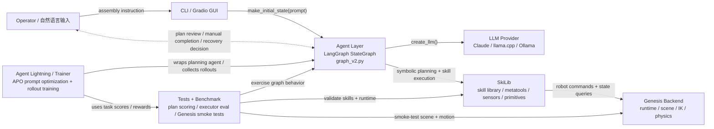
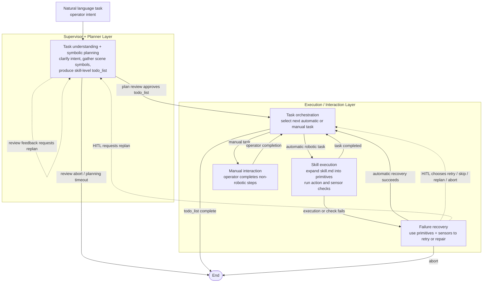
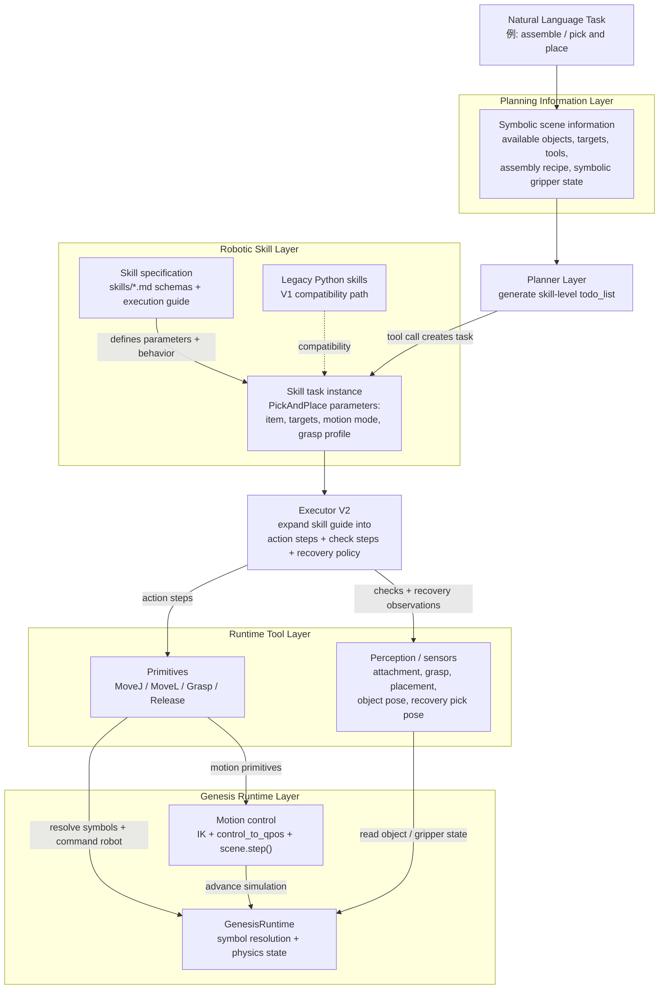
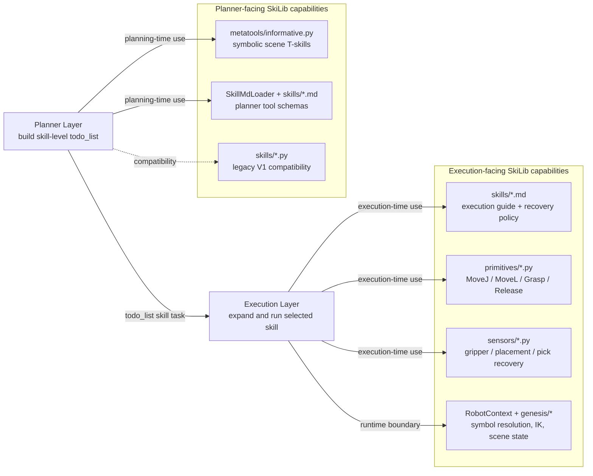

# RoboSkiAgent Project Summary

本文档用 Mermaid 图概括 RoboSkiAgent 当前主线架构。项目整体可以理解为：

> 自然语言装配任务 -> LangGraph 多节点决策 -> `skill.md` 高层技能展开 -> Genesis primitives 执行 -> sensors 验证与恢复。

当前主线是 V2：Planner 只生成 skill-level `todo_list`，Executor 再根据 `SkiLib/skills/*.md` 动态展开为 primitives 和 perception checks。

## 1. High-Level 项目模块与 Actors

这张图展示外部 actor、Agent 层、LLM provider、SkiLib 技能库，以及 Genesis 仿真后端之间的关系。

### 说明

- `Operator` 提供自然语言任务，例如 assemble、pick and place，或更具体的装配指令。
- `CLI / Gradio GUI` 是入口；GUI 支持 plan review、manual task、HITL recovery 等 interrupt 流程。
- `Agent Layer` 使用 LangGraph 组织状态机。当前 GUI 和 CLI 默认走 `graph_v2.py`。
- `LLM Provider` 由 `Agent/llm.py` 选择，可使用 Claude API、Ollama，或 llama.cpp 的 OpenAI-compatible server。
- `SkiLib` 不依赖 LangGraph，负责技能、primitive、sensor、场景符号解析。
- `GenesisRuntime` 持有实际 Genesis scene、robot、objects、targets 和 held-item 状态。
- `Agent Lightning / Trainer` 覆盖 `trainer/apoptimizer/` 和 `agldemo/` 一类训练入口，用于 APO prompt optimization、rollout collection 和 reward-driven 迭代。
- `Tests + Benchmark` 覆盖 `tests/benchmark/`、`tests/genesis_motion_smoke.py` 等验证入口，用来评估规划质量、executor 行为和 Genesis 运动链路。

## 2. 简略 Agent Flow

这张图展示一次任务从自然语言输入，到规划、审阅、分发、执行、失败恢复的主流程。

### 说明

- `Supervisor + Planner Layer` 负责把自然语言任务转成可执行的 skill-level `todo_list`：先做符号场景理解，再生成任务序列。
- Plan review 是 planning layer 和 execution layer 之间的 human gate：operator 可以 approve、要求 replan，或直接 abort。
- `Execution / Interaction Layer` 负责把 `todo_list` 落到当前任务：自动任务进入 skill execution，人工任务进入 manual interaction。
- Skill execution 关注两件事：根据 `skill.md` 展开 primitive 动作，并用 sensors 做执行后检查。
- Failure recovery 先尝试自动修复；无法确认时通过 HITL 箭头表达人工选择 retry、skip、replan 或 abort。

## 3. 分层 Skill / Tool 图

这张图按抽象层次展示 planning information、robotic skill、perception sensor、primitive 和 Genesis runtime 的关系。

### Skill Library 简略结构

这张图按使用者组织 `SkiLib`：Planner Layer 周围是 planning-time symbolic tools 和 skill schemas；Execution Layer 周围是执行指南、primitives、sensors 和 Genesis runtime adapter。

### 说明

- `Planning Information Layer` 是 Supervisor 使用的 T-skills，核心约束是只返回符号信息，不暴露坐标、矩阵或关节值。
- `Robotic Skill Layer` 表示可被 Planner 生成、可被 Executor 展开的高层技能任务；V2 主要由 `skills/*.md` 描述参数、执行指南、验证点和恢复策略。
- `Runtime Tool Layer` 是 Executor 的实际工具面：primitives 负责动作，sensors 负责执行时观察和恢复判断。
- `Genesis Runtime Layer` 是底层模拟依赖边界，集中处理符号解析、IK / control loop、`scene.step()` 和物理状态维护。

## 当前主线摘要

- `Agent/graph_v2.py`：当前 LangGraph 主线，拓扑与 V1 类似，但替换为 `planner_v2` 和 `executor_v2`。
- `Agent/nodes/planner_v2.py`：从 `SkillMdLoader` 生成 planner tools，输出 skill-level `todo_list`。
- `Agent/nodes/executor_v2.py`：读取 skill markdown body，先生成 execution plan，再执行 primitives 和 sensors，失败时进入 recovery。
- `SkiLib/skill_loader.py`：解析 `SkiLib/skills/*.md` 的 YAML frontmatter 和 markdown body。
- `SkiLib/robotcontext.py`：Genesis runtime facade，并初始化 primitive、skill、sensor registries。
- `SkiLib/genesis/runtime.py`：持有 Genesis scene、robot、targets、objects、tools，以及 grasp/release 和 placement 相关状态。
- `SkiLib/metatools/informative.py`：Supervisor 的 planning-time scene information tools。
- `SkiLib/sensors/*.py`：Executor 的 execution-time perception tools。
- `SkiLib/primitives/*.py`：Genesis 绑定的底层 robot primitives。

