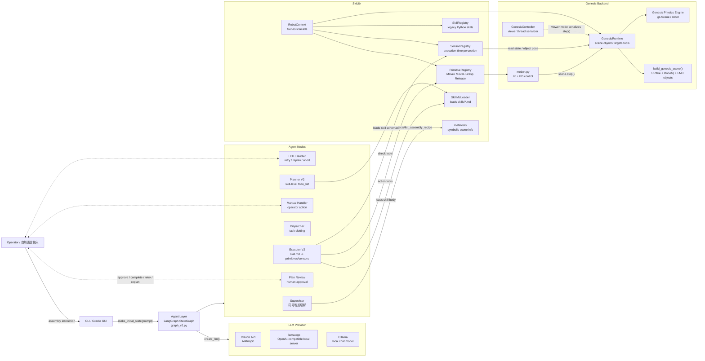
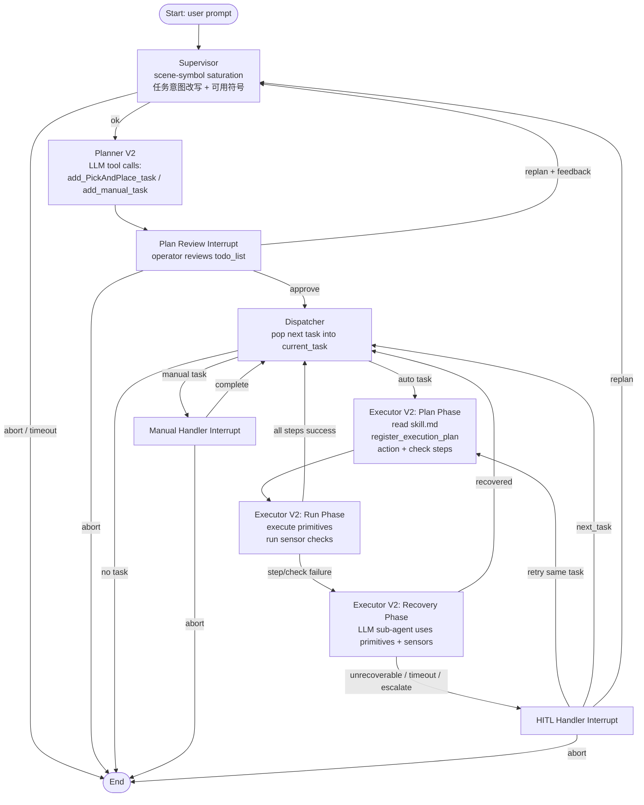
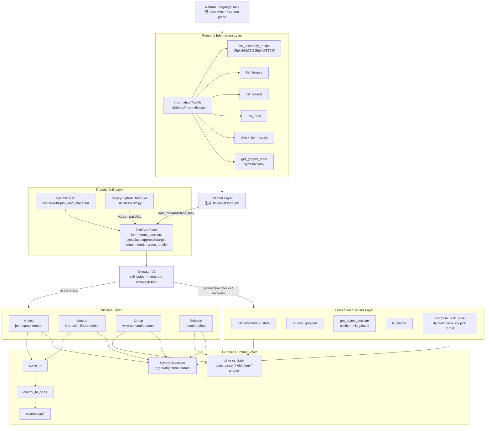

# RoboSkiAgent Project Summary

本文档用 Mermaid 图概括 RoboSkiAgent 当前主线架构。项目整体可以理解为：

> 自然语言装配任务 -> LangGraph 多节点决策 -> `skill.md` 高层技能展开 -> Genesis primitives 执行 -> sensors 验证与恢复。

当前主线是 V2：Planner 只生成 skill-level `todo_list`，Executor 再根据 `SkiLib/skills/*.md` 动态展开为 primitives 和 perception checks。

## 1. High-Level 项目模块与 Actors

这张图展示外部 actor、Agent 层、LLM provider、SkiLib 技能库，以及 Genesis 仿真后端之间的关系。

### 说明

- `Operator` 提供自然语言任务，例如 assemble、pick and place，或更具体的装配指令。
- `CLI / Gradio GUI` 是入口；GUI 支持 plan review、manual task、HITL recovery 等 interrupt 流程。
- `Agent Layer` 使用 LangGraph 组织状态机。当前 GUI 和 CLI 默认走 `graph_v2.py`。
- `LLM Provider` 由 `Agent/llm.py` 选择，可使用 Claude API、Ollama，或 llama.cpp 的 OpenAI-compatible server。
- `SkiLib` 不依赖 LangGraph，负责技能、primitive、sensor、场景符号解析。
- `GenesisRuntime` 持有实际 Genesis scene、robot、objects、targets 和 held-item 状态。

## 2. 简略 Agent Flow

这张图展示一次任务从自然语言输入，到规划、审阅、分发、执行、失败恢复的主流程。

### 说明

- `Supervisor` 只做 planning-time symbolic information gathering，不应该依赖物理坐标。
- `Planner V2` 使用 `SkillMdLoader` 从 `skills/*.md` 生成 tool schema，然后通过 LLM tool calls 写入 `todo_list`。
- `Plan Review` 是强制 human gate：operator 可以 approve、replan 或 abort。
- `Dispatcher` 一次只把一个 task 放入 `current_task`。
- `Executor V2` 分三阶段：
  - Plan phase：把高层 skill 变成 primitive/check execution plan。
  - Run phase：按顺序执行 primitives 和 sensors。
  - Recovery phase：失败时启动 LLM sub-agent，使用 primitives/sensors 尝试恢复。
- `HITL Handler` 处理无法自动恢复的失败，可 retry、跳过任务、replan 或 abort。

## 3. 分层 Skill / Tool 图

这张图按抽象层次展示 planning information、robotic skill、perception sensor、primitive 和 Genesis runtime 的关系。

### 说明

- `Planning Information Layer` 是 Supervisor 使用的 T-skills，核心约束是只返回符号信息，不暴露坐标、矩阵或关节值。
- `Robotic Skill Layer` 当前生产技能主要是 `PickAndPlace`。V2 通过 `SkiLib/skills/pick_and_place.md` 描述参数、标准执行序列、验证点和恢复策略。
- `Perception / Sensor Layer` 是 Executor 的 execution-time observation tools，可读取物理状态，例如是否抓住、是否放置成功、物体当前位置和动态 pick pose。
- `Primitive Layer` 是平台绑定的低层动作，目前包括 `MoveJ`、`MoveL`、`Grasp`、`Release`。
- `Genesis Runtime Layer` 负责符号解析、IK、控制循环、`scene.step()` 和物理状态维护。

## 当前主线摘要

- `Agent/graph_v2.py`：当前 LangGraph 主线，拓扑与 V1 类似，但替换为 `planner_v2` 和 `executor_v2`。
- `Agent/nodes/planner_v2.py`：从 `SkillMdLoader` 生成 planner tools，输出 skill-level `todo_list`。
- `Agent/nodes/executor_v2.py`：读取 skill markdown body，先生成 execution plan，再执行 primitives 和 sensors，失败时进入 recovery。
- `SkiLib/skill_loader.py`：解析 `SkiLib/skills/*.md` 的 YAML frontmatter 和 markdown body。
- `SkiLib/robotcontext.py`：Genesis runtime facade，并初始化 primitive、skill、sensor registries。
- `SkiLib/genesis/runtime.py`：持有 Genesis scene、robot、targets、objects、tools，以及 grasp/release 和 placement 相关状态。
- `SkiLib/metatools/informative.py`：Supervisor 的 planning-time scene information tools。
- `SkiLib/sensors/*.py`：Executor 的 execution-time perception tools。
- `SkiLib/primitives/*.py`：Genesis 绑定的底层 robot primitives。

