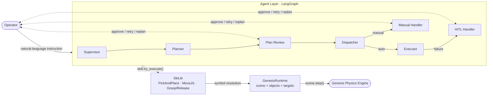

# RoboSkiAgent

RoboSkiAgent accepts natural-language assembly instructions and drives a simulated industrial robot through a LangGraph state machine. The current execution backend is **Genesis**, with mandatory human-in-the-loop gates at plan review, manual tasks, and failure recovery.

## Architecture



**Two-layer design:**

- **Planning:** Supervisor queries Genesis scene symbols only: targets, objects, tools, and gripper state. Planner builds a `todo_list` through skill-specific tool calls.
- **Execution:** Dispatcher slots one task at a time. Executor calls SkiLib skills, which resolve symbolic names into Genesis targets/objects and return structured `SkillResult` values.

## Directory Structure

```text
RoboSkiAgent/
├── Agent/                       # LangGraph orchestration layer
│   ├── graph.py                 # build_graph() state machine assembly
│   ├── graph_v2.py              # current V2 graph entry used by CLI/GUI paths
│   ├── state.py                 # GlobalState TypedDict
│   ├── llm.py                   # LLM factory: claude / ollama
│   ├── gui.py                   # Gradio UI with interrupt support and Genesis viewer mode
│   ├── __main__.py              # CLI entry; HITL interrupt flow is limited
│   ├── prompts/                 # supervisor / planner / executor prompts
│   └── nodes/                   # supervisor, planner, plan_review, dispatcher,
│                                # executor, manual_handler, hitl_handler
├── SkiLib/                      # Skill library; no LangGraph dependency
│   ├── base.py                  # BasePrimitive / BaseSkill / SkillResult
│   ├── registry.py              # SkillRegistry singleton
│   ├── robotcontext.py          # Genesis runtime facade, preserves old class name
│   ├── genesis/                 # Genesis scene/runtime/controller helpers
│   │   ├── scene.py             # UR16e + Robotiq + tray/object/target scene builder
│   │   ├── runtime.py           # GenesisRuntime scene and symbolic registries
│   │   ├── motion.py            # IK and PD control helpers
│   │   ├── controller.py        # macOS/viewer thread serializer
│   │   └── types.py             # SceneTarget / SceneObject / TargetPose
│   ├── metatools/               # read-only scene tools for Supervisor
│   ├── primitives/              # Genesis MoveJ, MoveL, Grasp, Release
│   └── skills/                  # PickAndPlace
├── res/                         # URDF, STL assets, Genesis scene experiments
└── tests/                       # benchmark and Genesis smoke tests
```

## Tech Stack

| Component | Choice |
|-----------|--------|
| Agent orchestration | LangGraph (`StateGraph`) |
| LLM framework | LangChain Core |
| LLM providers | Claude via Anthropic, or local Ollama |
| Robot simulation | Genesis (`genesis-world`) |
| Robot model | UR16e + Robotiq 2F-85 URDF |
| UI | Gradio |
| Language | Python 3.11+ |

## Prerequisites

- Python 3.11+
- A virtual environment or conda environment
- Anthropic API key **or** a local Ollama instance
- Genesis dependencies supported by your platform

RoboDK is no longer the active execution backend. Any remaining RoboDK dependency or documentation is legacy/reference material unless explicitly marked otherwise.

## Installation

```bash
git clone <repo-url>
cd RoboSkiAgent

python -m venv .venv
source .venv/bin/activate

pip install -r requirements.txt
```

On Windows, activate with:

```bash
.venv\Scripts\activate
```

### Scene Assets: IndustRealKit

The `res/industrealkit/` directory contains only Git LFS pointer files in this repository. The actual STL/OBJ meshes (gears, pegs, hole plates) are stored in the upstream IndustRealKit repository and must be fetched separately.

```bash
# Install Git LFS if not already present
# Ubuntu/Debian:
sudo apt install git-lfs
# Conda:
conda install -c conda-forge git-lfs

# Clone IndustRealKit and pull LFS assets
git clone https://github.com/NVlabs/industrealkit.git /tmp/industrealkit
cd /tmp/industrealkit
git lfs install
git lfs pull

# Copy mesh folders into res/
cp -r /tmp/industrealkit/gears         <repo-root>/res/industrealkit/
cp -r /tmp/industrealkit/pegs_and_holes <repo-root>/res/industrealkit/
```

The genesis scene scripts (e.g. `res/genesis_scene_test.py`) and `SkiLib/genesis/scene.py` expect assets at `res/industrealkit/gears/stl/` and `res/industrealkit/pegs_and_holes/stl/`. Without them, scene builds will fail silently (meshes load as empty geometry).

## Configuration

Copy the example env file and fill in your keys:

```bash
cp .env.example .env
```

Minimum useful fields:

```env
# LLM provider: "claude" or "ollama"
ROBOSKI_LLM_PROVIDER=claude
ANTHROPIC_API_KEY=sk-ant-...

# Genesis runtime
ROBOSKI_GENESIS_VIEWER=0
ROBOSKI_GENESIS_BACKEND=cpu

# For local Ollama:
# ROBOSKI_LLM_PROVIDER=ollama
# OLLAMA_MODEL_ID=qwen3:latest

# Optional: LangSmith tracing
# LANGSMITH_TRACING=true
# LANGSMITH_API_KEY=lsv2_...
# LANGSMITH_PROJECT=robo-ski-agent
```

## Usage

### GUI, headless Genesis

```bash
python -m Agent.gui
```

This starts the Gradio interface at `http://localhost:7860`. Use this path for end-to-end runs with plan review and recovery interrupts.

### GUI with Genesis viewer

```bash
ROBOSKI_GENESIS_VIEWER=1 python -m Agent.gui
```

Viewer mode uses `GenesisController` to serialize `scene.step()` calls onto the Genesis thread and keep the robot holding position while the UI is idle.

### CLI, limited HITL support

```bash
python -m Agent "Pick Part_A_1 from PartA_Pick and place it at AssemblySlot_1."
```

The CLI still uses a non-interactive graph invocation path. It can hit `NodeInterrupt` at plan review or recovery gates, so the GUI remains the recommended path for full human-in-the-loop flows.

### Skip pre-checks for debugging

```bash
python -m Agent "Pick Part_A_1 and place it at AssemblySlot_1." --skip-check
```

`--skip-check` bypasses planning-time IK/reachability checks. It does not add collision checking.

## Current Scene Symbols

Core objects:

```text
Part_A_1
Part_B_1
Part_C_1
```

Core targets:

```text
Home_position
PartA_Approach, PartA_Pick
PartB_Approach, PartB_Pick
PartC_Approach, PartC_Pick
AssemblySlot_1_Approach, AssemblySlot_1
AssemblySlot_2_Approach, AssemblySlot_2
AssemblySlot_3_Approach, AssemblySlot_3
```

## Current Limitations

- `PickAndPlace` is the only production skill.
- `MoveL` uses fixed waypoint sampling and has no adaptive step size or singularity handling.
- Collision checking is not equivalent to RoboDK `MoveJ_Test` / `MoveL_Test`; current checks are mainly IK and timeout based.
- `Grasp` / `Release` use a Genesis weld constraint to represent attachment, not contact-rich physical grasping.
- Dynamic tracking, such as conveyor following, is not implemented.
- CLI interrupt resume is not complete; use the GUI for HITL workflows.

## Logging

Logs are written to the console and `logs/roboski.log` with rotation.

```env
ROBOSKI_LOG_LEVEL=INFO
```

## More Documentation

- `SkiLib/ARCHITECTURE.md` describes the current Genesis architecture.
- `GENESIS_MIGRATION_PLAN.md` records the migration phases, completed work, deviations, and remaining risks.
- `ROADMAP.md` summarizes strengths, limitations, and next development priorities.
