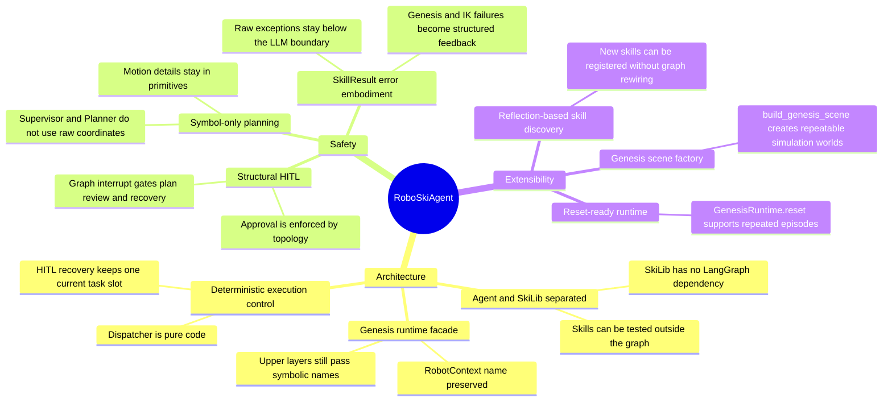
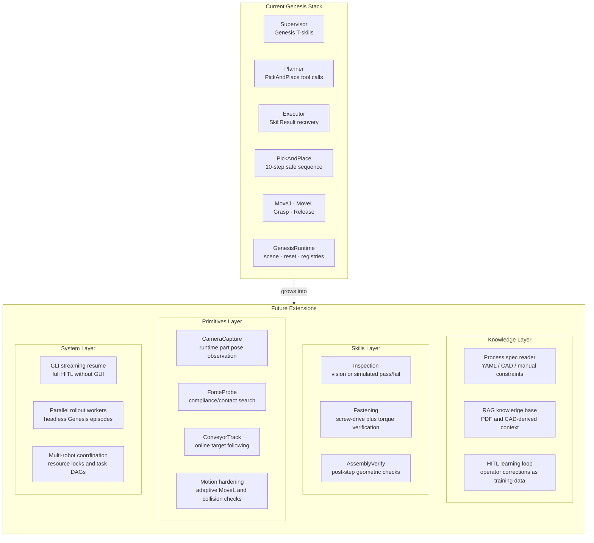
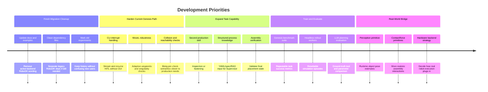
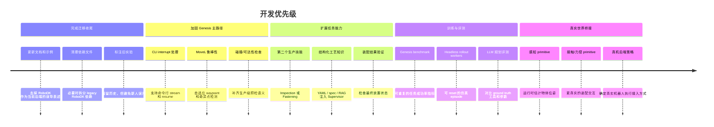

# RoboSkiAgent — Strengths, Limitations & Roadmap

> For presentation and planning use. Last updated: 2026-05-06.

---

## Current Status

RoboSkiAgent has moved from a RoboDK-centered prototype to a Genesis-backed execution stack. The current production path is:

```text
Operator instruction
  -> LangGraph Agent
  -> SkillRegistry
  -> PickAndPlace
  -> Genesis MoveJ / MoveL / Grasp / Release
  -> GenesisRuntime / Genesis scene
```

The system can expose symbolic Genesis scene information to the Supervisor, generate a pick-and-place plan, route it through human review in the GUI, and execute it against a UR16e + Robotiq 2F-85 Genesis scene.

---

## Strengths



---

## Current Limitations

| # | Limitation | Impact | Root Cause / Notes |
|---|------------|--------|--------------------|
| L1 | Only one production skill: `PickAndPlace` | Planner cannot yet demonstrate meaningful multi-skill selection | Inspection, fastening, verification skills are future work |
| L2 | No perception layer | Part poses are static Genesis targets; real-world pose variation is not handled | No camera/depth primitive yet |
| L3 | No structured process knowledge base | Assembly knowledge must be supplied in prompts or user instructions | RAG/YAML/process-spec integration is not active |
| L4 | CLI interrupt resume is incomplete | CLI cannot reliably finish flows that require human approval | GUI is the current end-to-end path |
| L5 | `MoveL` uses fixed waypoint sampling | Long moves, singularities, or difficult IK regions may fail abruptly | No adaptive step sizing or singularity handling yet |
| L6 | Collision checking is limited | Genesis pre-checks are not equivalent to old RoboDK collision tests | Current checks focus on IK and execution timeout |
| L7 | Grasping is kinematic | Attachment validates task semantics, not contact-rich grasp physics | Uses weld constraints, not friction/contact modeling |
| L8 | Documentation and dependencies are still being cleaned | Some legacy files still mention RoboDK as if active | Genesis migration Phase 7 |

---

## Future Extension Points



---

## Priority Roadmap



---

## Key Design Tensions

| Tension | Current Choice | Alternative | Why this choice |
|---------|----------------|-------------|-----------------|
| Symbolic vs coordinate planning | LLM sees names only | Let Planner use positions | Reduces spatial hallucination and keeps geometry in testable primitives |
| Structural vs prompt HITL | LangGraph `interrupt()` gates | Prompt-only approval | Topology is model-agnostic and auditable |
| Genesis weld grasp vs physical grasp | Weld constraint attachment | Contact/friction grasp simulation | Welds are enough to validate symbolic task execution before deeper physics work |
| GUI-first vs CLI-first HITL | GUI is recommended | Complete CLI resume loop first | GUI already supports human review and recovery; CLI can be hardened next |
| Single current task vs parallel queue | One active execution slot | Parallel execution DAG | Simpler retry/replan semantics while the skill set is still small |

---

# RoboSkiAgent — 优势、不足与发展路线（中文版）

> 演示和规划使用。最后更新：2026-05-06。

## 当前状态

RoboSkiAgent 已从 RoboDK 原型迁移为 Genesis 执行后端。当前主路径是：

```text
用户自然语言指令
  -> LangGraph Agent
  -> SkillRegistry
  -> PickAndPlace
  -> Genesis MoveJ / MoveL / Grasp / Release
  -> GenesisRuntime / Genesis 场景
```

系统目前可以让 Supervisor 读取 Genesis 场景符号，让 Planner 生成 pick-and-place 计划，在 GUI 中经过人工审批后执行 UR16e + Robotiq 2F-85 的 Genesis 装配场景。

## 当前不足

| # | 不足 | 影响 | 说明 |
|---|------|------|------|
| L1 | 只有一个生产技能 `PickAndPlace` | 尚不能充分验证多技能选择和组合规划 | Inspection / Fastening / Verify 仍待实现 |
| L2 | 没有感知层 | 零件位姿仍是静态 Genesis target | 未接入相机或深度传感 primitive |
| L3 | 没有结构化工艺知识库 | 工艺知识主要来自 prompt 或用户输入 | YAML / RAG / 文档解析未接入主流程 |
| L4 | CLI interrupt resume 未完成 | CLI 无法稳定完成需要人工审批的流程 | GUI 是当前端到端推荐入口 |
| L5 | `MoveL` 采用固定 waypoint | 长距离、奇异点或 IK 困难区域可能失败 | 缺少自适应步长和奇异点处理 |
| L6 | 碰撞检查有限 | 当前不等价于旧 RoboDK 碰撞预检 | 主要依赖 IK 和执行超时 |
| L7 | 抓取是运动学语义 | 验证任务流程，不验证真实接触抓取 | 当前用 weld constraint |
| L8 | 文档和依赖仍在清理 | 部分旧文档仍可能出现 RoboDK 主后端叙事 | Genesis 迁移 Phase 7 |

## 优先级路线图


