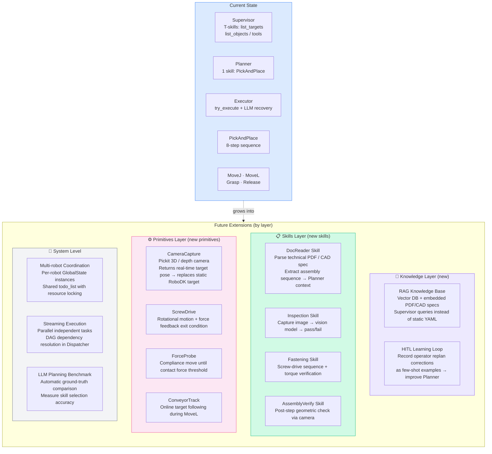
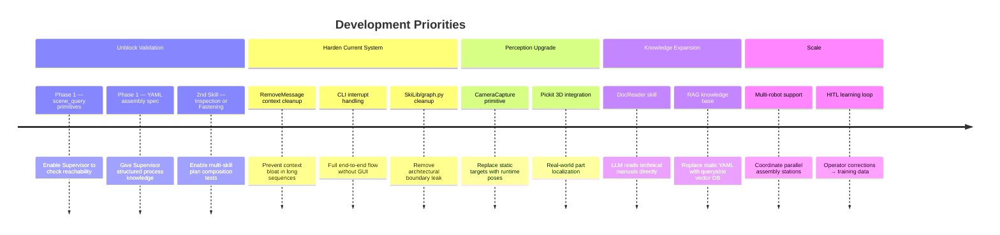
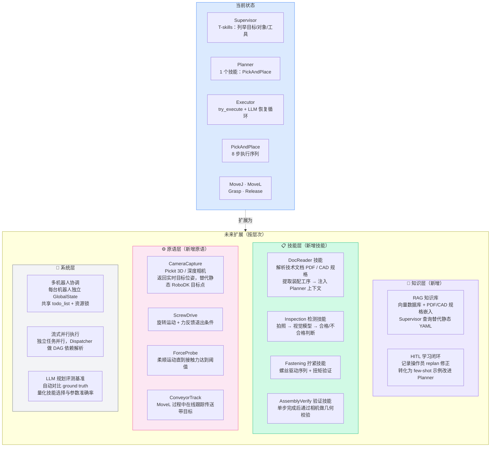
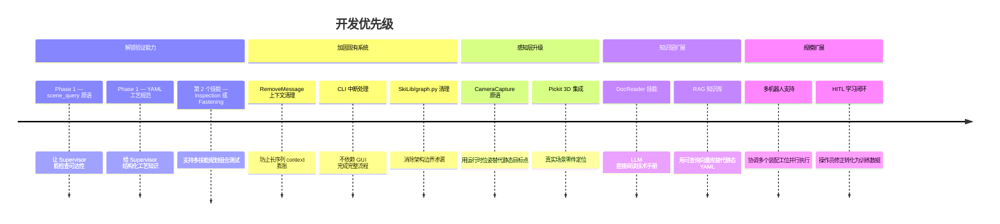

# RoboSkiAgent — Strengths, Limitations & Roadmap

> For presentation use. Last updated: 2026-03-30.

---

## Strengths

```mermaid
mindmap
  root((RoboSkiAgent))
    Architecture
      Agent ↔ SkiLib fully decoupled
        SkiLib has zero LangGraph dependency
        Can be tested standalone
      Deterministic execution control
        Dispatcher is pure code — no LLM in routing
        Task flow is 100% predictable and auditable
      Symbol-only planning
        Supervisor / Planner never touch coordinates
        Eliminates an entire class of spatial hallucinations
    Safety
      Structural HITL
        interrupt() enforced by graph topology
        Even a weak LLM cannot bypass the approval gate
      @require_robot_active global lock
        halt_flag=True freezes all R-skills at the base layer
        Prevents physical damage from hallucinated actions
      Error embodiment via SkillResult
        All hardware errors translated to structured LLM-readable feedback
        Raw tracebacks never reach the LLM
    Extensibility
      Reflection-based skill discovery
        Drop a new .py in skills/ — auto-registered, no config
      Auto tool schema generation
        New skill immediately appears in Planner's tool set
        Schema derived from try_execute signature via Pydantic
      LLM-agnostic factory
        Switch Claude ↔ Ollama via env var ROBOSKI_LLM_PROVIDER
        No code changes required
```

---

## Current Limitations

| # | Limitation | Impact | Root Cause |
|---|-----------|--------|------------|
| **L1** | **Only 1 skill (PickAndPlace)** — cannot validate multi-skill planning or skill selection | Cannot stress-test Planner's composition ability; LLM has no meaningful choice to make | Phase 1 skills not yet built |
| **L2** | **No Perception layer** — target positions must be pre-defined static RoboDK targets | Breaks in real assembly where part poses vary at runtime | No camera / sensor primitive |
| **L3** | **Phase 1 (scene_query + YAML spec) unbuilt** — Supervisor cannot read process specs | Assembly knowledge must be in the prompt; no structured process knowledge base | Phase 1 not started |
| **L4** | **RemoveMessage not implemented** — Executor / Planner messages accumulate in `messages` | Context grows unboundedly in long sequences; LLM performance degrades | Checklist item 3.5.7 / 4.3 |
| **L5** | **CLI interrupt handling missing** — `graph.invoke()` raises `NodeInterrupt` at any HITL gate | CLI cannot run end-to-end flows requiring human approval | Checklist 6.5 |
| **L6** | **`SkiLib/graph.py` misplaced** — contains LangGraph import, violates SkiLib's no-LangGraph rule | Architectural boundary leak; risks unintended coupling | Historical artifact, never cleaned |
| **L7** | **Only simulation tested** — Grasp/Release real-robot paths are `# TODO setDO + feedback wait` | Unknown whether skill timing / error handling holds on real hardware | Real robot integration not started |

---

## Future Extension Points

How the system grows — organized by architectural layer.



---

## Priority Roadmap

What to build next, and why.



---

## Key Design Tensions

Decisions that involve deliberate trade-offs worth discussing.

| Tension | Current Choice | Alternative | Why this choice |
|---------|---------------|-------------|-----------------|
| **Explicit vs. implicit approach points** | Explicit params (`pick_approach`, `place_approach`) | Auto-lookup by naming convention (`Approach_<target>`) | LLM must reason about all parameters explicitly; hidden conventions are opaque to the model |
| **Structural vs. prompt-based HITL** | `interrupt()` in graph topology | Prompt: "always ask before executing" | Prompt-based gates fail with weaker models; structural gates are model-agnostic |
| **Tool-call planning vs. structured JSON** | Dynamic `add_<Skill>_task` tool calls | `with_structured_output(TodoList)` | Tool calling degrades gracefully; JSON schema output breaks silently when model forgets fields |
| **SkillResult vs. raw exceptions** | All errors wrapped in `SkillResult` | Pass exceptions to LLM | Raw tracebacks leak file paths and line numbers; structured errors provide actionable suggestions |
| **Single execution slot** | `current_task: dict` — one task at a time | Queue-based parallel execution | Simplifies HITL recovery (retry = re-run same slot); parallel execution complicates interrupt semantics |

---

---

# RoboSkiAgent — 优势、不足与发展路线（中文版）

> 演示文稿用。最后更新：2026-03-30。

---

## 优势

```mermaid
mindmap
  root((RoboSkiAgent))
    架构设计
      Agent 与 SkiLib 完全解耦
        SkiLib 零 LangGraph 依赖
        可独立测试和部署
      确定性执行控制
        Dispatcher 是纯代码节点，路由不依赖 LLM
        任务流转 100% 可预测、可审计
      符号层规划
        Supervisor / Planner 永不接触坐标
        从根本上消除一整类空间幻觉问题
    安全机制
      结构性人机协作门（HITL）
        interrupt() 由图拓扑强制触发
        即使是弱模型也无法绕过审批节点
      @require_robot_active 全局锁
        halt_flag=True 时从底层冻结所有动作技能
        防止 LLM 幻觉动作导致物理碰撞
      错误具身化（SkillResult）
        所有硬件错误翻译为结构化 LLM 可读反馈
        原始 traceback 永不传递给 LLM
    可扩展性
      基于反射的技能发现
        新建 .py 放入 skills/ 即自动注册，无需配置
      工具 Schema 自动生成
        新技能立即出现在 Planner 的工具集中
        Schema 由 try_execute 签名经 Pydantic 自动推导
      LLM 无关工厂
        通过环境变量 ROBOSKI_LLM_PROVIDER 切换 Claude / Ollama
        无需修改任何代码
```

---

## 当前不足

| # | 不足 | 影响 | 根因 |
|---|------|------|------|
| **L1** | **只有 1 个 Skill（PickAndPlace）**，无法验证多技能规划与选择能力 | Planner 的组合规划能力无从测试；LLM 实际上没有有意义的技能选择 | Phase 1 技能尚未建立 |
| **L2** | **没有感知层**——目标位置必须是 RoboDK 中预定义的静态目标点 | 真实装配中零件位姿随机变化，系统无法适应 | 没有相机 / 传感器 Primitive |
| **L3** | **Phase 1（场景查询 + YAML 工艺规范）未实现**——Supervisor 无法读取工艺规格 | 装配知识只能写在 prompt 里，没有结构化知识库 | Phase 1 尚未启动 |
| **L4** | **RemoveMessage 未实现**——Executor / Planner 消息在 `messages` 中持续堆积 | 长序列任务 context 无限膨胀，LLM 性能下降 | Checklist 3.5.7 / 4.3 |
| **L5** | **CLI 中断处理缺失**——`graph.invoke()` 在任意 HITL 节点抛出 `NodeInterrupt` | CLI 无法完成含人工审批的完整流程 | Checklist 6.5 |
| **L6** | **`SkiLib/graph.py` 错位**——含 LangGraph 导入，违反 SkiLib 无 LangGraph 约束 | 架构边界渗漏，存在意外耦合风险 | 历史遗留，从未清理 |
| **L7** | **只在仿真中测试**——Grasp/Release 真机路径为 `# TODO setDO + feedback wait` | 不确定真机上的技能时序与错误处理是否有效 | 真机集成尚未启动 |

---

## 未来扩展点

按架构层次组织，展示系统可以往哪里生长。



---

## 优先级路线图



---

## 关键设计取舍

演示 Q&A 环节可能被问到的设计决策。

| 取舍点 | 当前选择 | 另一种方案 | 选择理由 |
|--------|---------|-----------|---------|
| **接近点：显式 vs 隐式** | 显式参数（`pick_approach`、`place_approach`） | 按命名约定自动查找（`Approach_<target>`） | LLM 必须明确推理所有参数；隐式约定对模型不透明，调试困难 |
| **HITL：结构性 vs 提示词** | `interrupt()` 在图拓扑中强制触发 | prompt 要求"执行前必须请示" | 提示词门控在弱模型上失效；结构性门控与模型能力无关 |
| **规划：工具调用 vs 结构化 JSON** | 动态 `add_<Skill>_task` 工具调用 | `with_structured_output(TodoList)` | 工具调用降级优雅；JSON schema 输出在模型遗漏字段时静默失败 |
| **错误：SkillResult vs 原始异常** | 所有错误封装进 `SkillResult` | 原始 Exception / traceback 传给 LLM | 裸 traceback 泄露文件路径和行号；结构化错误提供可操作建议 |
| **执行槽：单任务 vs 并行队列** | `current_task: dict`，单任务执行槽 | 并行任务队列 | 简化 HITL 恢复语义（retry = 重跑同一槽位）；并行执行使 interrupt 语义复杂化 |
