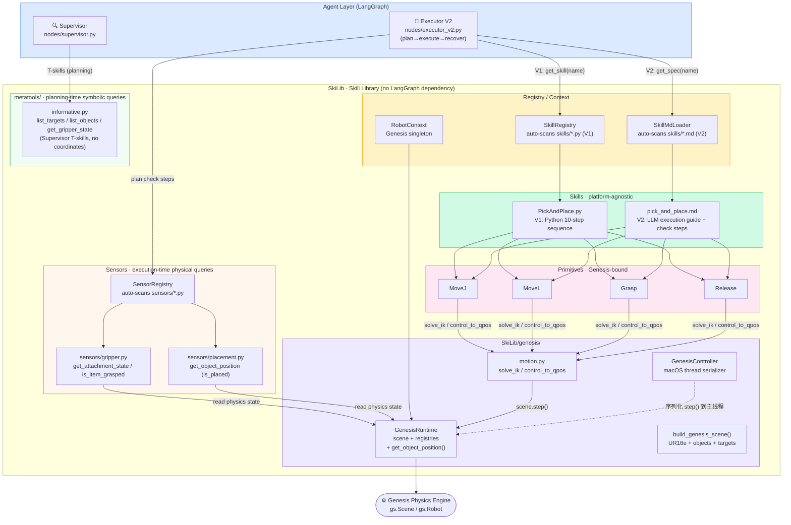
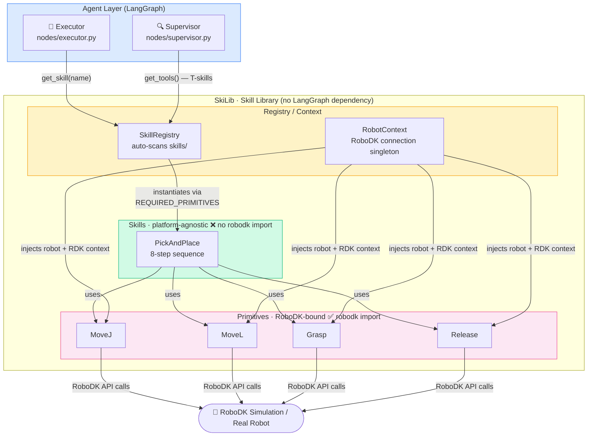

# SkiLib 架构设计

> **迭代说明**：本文档原描述 RoboDK 后端架构（见文末"历史参考"章节），当前实现已完整迁移至 Genesis。下方各节描述现状。

---

## 当前实现：Genesis 后端（2026-05-08，含 V2 双轨技能体系）

### 架构总览



### 两个工具层的定位区别

| 层 | 路径 | 调用方 | 规则 |
|----|------|--------|------|
| **metatools** | `metatools/informative.py` | Supervisor（规划阶段） | 只返回符号名，禁止坐标 |
| **sensors** | `sensors/*.py` | Executor V2 plan check / recovery | 可返回物理量（距离、布尔状态） |

> **设计意图**：Supervisor 永远只看符号，Executor 在执行和恢复时可以读取物理量用于判断和纠错。

### 关键组件

| 组件 | 文件 | 职责 |
|------|------|------|
| `GenesisRuntime` | `genesis/runtime.py` | 场景单例，持有 scene/robot/targets/objects 注册表；`get_object_position()` 读取工件 XY 放置状态 |
| `build_genesis_scene()` | `genesis/scene.py` | 工厂：加载 URDF，创建 UR16e + Robotiq 2F-85 + 零件 + 目标点 |
| `solve_ik()` | `genesis/motion.py` | 包装 `robot.inverse_kinematics()`，返回 `IKResult` |
| `control_to_qpos()` | `genesis/motion.py` | PD 控制循环，最多 `max_steps` 次 `scene.step()` |
| `GenesisController` | `genesis/controller.py` | 把所有 `scene.step()` 序列化到单一线程（macOS viewer 限制） |
| `RobotContext` | `robotcontext.py` | 单例门面，名称不变以保持上游调用兼容；代理 `get_object_position()` |
| `SkillMdLoader` | `skill_loader.py` | V2 技能加载器：解析 `skills/*.md`，生成 Pydantic schema，暴露 `body` 给 Executor |
| `SensorRegistry` | `sensors/__init__.py` | 自动发现 `sensors/*.py`，汇聚所有 sensor tools 供 Executor V2 使用 |
| `sensors/gripper.py` | `sensors/gripper.py` | 执行时夹爪状态查询：`get_attachment_state` / `is_item_grasped` |
| `sensors/placement.py` | `sensors/placement.py` | 执行时放置验证：`get_object_position` → `is_placed`（XY 距 place target ≤ 5 cm） |

---

### 仿真入口与运行模式

#### 进入仿真

| 命令 | viewer | 模式 |
|------|--------|------|
| `ROBOSKI_GENESIS_VIEWER=1 python -m Agent.gui` | ✅ | 交互 GUI + 实时可视化 |
| `python -m Agent.gui` | ❌ headless | 交互 GUI，无 viewer |
| `python -m Agent "把零件放到目标点"` | ❌ headless | CLI 单次运行（V2 graph） |
| `python res/genesis_scene_test.py` | ✅ | 裸场景测试，无 Agent |
| `python SkiLib/main.py` | ❌ | T-skills 调试，无 Agent |

**环境变量**

| 变量 | 默认 | 说明 |
|------|------|------|
| `ROBOSKI_GENESIS_VIEWER` | `0` | `1` 开启 viewer |
| `ROBOSKI_GENESIS_BACKEND` | `cpu` | `cpu` / `gpu` |
| `ROBOSKI_SKIP_CHECK` | 未设 | `1` 跳过 IK/碰撞检查 |

#### `scene.step()` 的两种驱动方式

**有 viewer（GUI）**
```
主线程：GenesisController.run()
  ├─ 有任务：执行 fn() → scene.step()
  └─ 空闲：hold position → scene.step()   ← ~60 fps 实时循环
后台线程：Gradio + LangGraph Agent
```

**无 viewer（CLI/headless）**
```
没有空跑循环。scene.step() 只在 primitive 执行期间被
control_to_qpos() 驱动（最多 240 步 / primitive）。
```

---

### LLM RL 后训练兼容性分析

> 这里讨论的是用 Genesis 作为 **reward oracle**，对 LLM Agent 进行 RL 后训练（GRPO / PPO / REINFORCE 等），而不是训练运动控制 policy。

#### 适合做什么

用 Genesis 环境验证 LLM 生成的装配计划是否真实可执行，将任务成功/失败作为稀疏 reward 信号，反向更新 LLM 权重（类似 DeepSeek-R1 / Tulu 中的 process reward）。

```
LLM 采样 N 条 rollout（自然语言计划 → tool calls）
       ↓
Genesis 执行每条 rollout，返回 success / error_type / steps_taken
       ↓
reward = success_flag ± shaping（可选：步骤数惩罚、IK 失败惩罚等）
       ↓
GRPO / PPO 更新 LLM 权重
```

#### 现有架构对这个流程的支持程度

**已经兼容 ✅**

- `SkillResult.success` / `error_type` / `suggestion` 已是结构化 reward 信号，不需要额外包装
- `GenesisRuntime` 是纯 Python 对象，可在子进程/线程中独立实例化，适合并发 rollout
- `build_genesis_scene()` 是无副作用工厂函数，每次调用建立独立场景，适合多环境并行
- `_GENESIS_INITIALIZED` 全局锁已处理重复 `gs.init()` 问题，多进程时各进程独立初始化不冲突
- Primitives 的 `try_execute()` 已捕获所有异常并返回 `SkillResult`，不会让 rollout worker crash

**需要改造 ⚠️**

1. **rollout 需要 scene reset**

   当前无 `reset()` 方法。每个 episode 需要重建场景（重新调用 `build_genesis_scene()`），开销较高。
   
   **建议**：在 `GenesisRuntime` 中增加 `reset()` 方法，通过 `robot.set_dofs_position(home_qpos)` + `entity.set_pos()` 复位，避免重建 scene。

2. **GenesisController 线程模型不适合多进程 rollout**

   RL rollout 通常用多进程（`multiprocessing` 或 Ray worker），而 `GenesisController` 是单进程内的线程序列化器。多进程场景下每个 worker 应拥有自己的 `GenesisRuntime`，不需要 `GenesisController`（无 viewer）。

3. **rollout worker 应以 headless 模式运行**

   ```python
   # rollout worker 的正确初始化方式
   os.environ["ROBOSKI_GENESIS_VIEWER"] = "0"
   runtime = GenesisRuntime(show_viewer=False)
   # 直接调用 primitive，不走 GenesisController
   ```

4. **reward shaping 需要新增中间信号**

   `SkillResult` 目前缺少：执行步数、IK 求解迭代次数、末端轨迹长度等 dense reward 候选项。可在 `control_to_qpos()` 返回值中附加这些信息。

#### 推荐的 rollout 收集架构（供参考）

```
训练进程（LLM + GRPO trainer）
   │
   ├─ rollout_worker_0 (subprocess)
   │     └─ GenesisRuntime(headless) + SkillRegistry
   │         执行 LLM plan → 返回 (plan, reward, trace)
   │
   ├─ rollout_worker_1
   │     └─ GenesisRuntime(headless) + SkillRegistry
   │
   └─ ... × N workers
```

各 worker 无 viewer、无 `GenesisController`，`scene.step()` 直接由 `control_to_qpos()` 驱动，性能最优。

---

## 历史参考：原 RoboDK 架构（已废弃）

> 以下内容描述 Genesis 迁移前的 RoboDK 架构，保留以记录迭代过程。

---

## 🎯 核心设计原则

### 1️⃣ 分层解耦



### 2️⃣ 依赖注入模式
- **Primitives**: 自动实例化，统一管理
- **Skills**: 通过构造函数注入primitives，无硬依赖
- **好处**: 易测试、可移植、低耦合

---

## 📦 组件说明

### RobotContext (单例)
**职责**: 
- 管理RoboDK连接
- 自动初始化PrimitiveRegistry
- 提供全局访问点

**使用**:
```python
context = RobotContext()  # 单例，多次调用返回同一实例
robot = context.robot
RDK = context.RDK
primitives = context.primitives  # 快捷访问所有primitives
```

---

### PrimitiveRegistry (单例)
**职责**:
- 自动扫描 `primitives/` 文件夹
- 实例化所有 `BasePrimitive` 子类
- 集中管理primitive生命周期

**自动发现规则**:
1. 扫描 `SkiLib.primitives.motion` 模块（可扩展到整个文件夹）
2. 查找所有 `BasePrimitive` 子类
3. 自动实例化并注册到字典

**扩展方式**:
```python
# 方法1: 放到primitives/文件夹（自动发现）
# SkiLib/primitives/gripper.py
class Grasp(BasePrimitive):
    pass

# 方法2: 手动注册（用于外部扩展）
context = RobotContext()
context.primitive_registry.register('CustomPrimitive', my_primitive)
```

**获取primitives**:
```python
# 方式1: 字典访问
moveJ = context.primitives['MoveJ']

# 方式2: Registry方法
moveJ = context.primitive_registry.get('MoveJ')

# 方式3: 获取所有
all_primitives = context.primitive_registry.get_all()
```

---

### BasePrimitive (抽象基类)
**职责**:
- 定义primitive接口 (`check`, `execute`, `try_execute`)
- 持有 `robot` 和 `RDK` 实例

**实现要求**:
```python
class MoveJ(BasePrimitive):
    def __init__(self, robot_object, RDK_object):
        super().__init__(robot_object, RDK_object)
    
    def check(self, target, ref_frame=None) -> CheckResult:
        # 检查逻辑（碰撞、IK、关节限位等）
        pass
    
    def execute(self, target, ref_frame=None):
        # 执行逻辑
        pass
    
    def try_execute(self, target, ref_frame=None):
        # check + execute
        pass
```

**平台依赖**:
- ✅ **允许** import robodk（底层实现必须依赖平台）
- ✅ 在 `primitives/` 文件夹中实现
- ✅ 自动被PrimitiveRegistry发现

---

### BaseSkill (抽象基类)
**职责**:
- 定义skill接口 (`check`, `execute`, `try_execute`)
- 通过依赖注入接收primitives

**实现要求**:
```python
class PickAndPlace(BaseSkill):
    def __init__(self, moveJ, moveL, grasp=None, release=None):
        # 依赖注入：接收primitive实例
        super().__init__(
            moveJ=moveJ, 
            moveL=moveL, 
            grasp=grasp, 
            release=release
        )
    
    def check(self, pick_target, place_target) -> CheckResult:
        # 组合多个primitive的check
        pick_ok = self.primitives['moveJ'].check(pick_target)
        place_ok = self.primitives['moveJ'].check(place_target)
        # ...返回综合结果
    
    def execute(self, pick_target, place_target):
        # 编排primitive执行顺序
        self.primitives['moveJ'].execute(pick_target)
        self.primitives['grasp'].execute()
        # ...
```

**平台无关性**:
- ❌ **禁止** import robodk（保持平台无关）
- ✅ 只依赖 `BasePrimitive` 接口
- ✅ 在 `skills/` 文件夹中实现
- ✅ 通过构造函数注入所需primitives

**为什么这样设计？**
```python
# 坏的设计（硬依赖）
class PickAndPlace(BaseSkill):
    def __init__(self, robot, RDK):
        from robodk import robolink  # ✗ 硬依赖RoboDK
        self.moveJ = MoveJ(robot, RDK)

# 好的设计（依赖注入）
class PickAndPlace(BaseSkill):
    def __init__(self, moveJ, moveL):
        super().__init__(moveJ=moveJ, moveL=moveL)  # ✓ 只依赖接口
```

好处：
1. **可测试**: 可以mock primitives进行单元测试
2. **可移植**: 换成其他机器人平台，只需实现新的primitives
3. **解耦**: Skill逻辑不受底层API变化影响

---

## 🔄 完整工作流程

### 1. 初始化阶段
```python
# main.py
context = RobotContext()
# ↓ 自动执行：
# 1. 连接RoboDK (RDK, robot)
# 2. 创建PrimitiveRegistry
# 3. 扫描primitives/文件夹
# 4. 实例化所有primitives (MoveJ, MoveL, ...)
# 5. 注册到registry字典

primitives = context.primitives
# {'MoveJ': <MoveJ instance>, 'MoveL': <MoveL instance>, ...}
```

### 2. Primitive使用（直接）
```python
# 获取primitive
moveJ = primitives['MoveJ']

# 检查
result = moveJ.check(target)
if result.is_valid:
    moveJ.execute(target)
```

### 3. Skill使用（组合）
```python
# 创建skill（注入primitives）
from SkiLib.skills.pick_and_place import PickAndPlace

skill = PickAndPlace(
    moveJ=primitives['MoveJ'],
    moveL=primitives['MoveL'],
    grasp=primitives.get('Grasp')  # 可选primitive
)

# 使用skill
pick = context.RDK.Item("Pick Target")
place = context.RDK.Item("Place Target")

skill.try_execute(pick, place)
```

---

## 🧪 测试策略

### Primitive测试（集成测试）
需要真实RoboDK环境：
```python
def test_moveJ():
    context = RobotContext()
    moveJ = context.primitives['MoveJ']
    
    target = [0, 0, 90, 0, 0, 0]  # 关节角度
    result = moveJ.check(target)
    assert result.is_valid
```

### Skill测试（单元测试）
可以mock primitives：
```python
from unittest.mock import Mock

def test_pick_and_place():
    # Mock primitives
    mock_moveJ = Mock(spec=BasePrimitive)
    mock_moveJ.check.return_value = CheckResult(is_valid=True)
    
    # 测试skill逻辑（无需RoboDK）
    skill = PickAndPlace(moveJ=mock_moveJ, moveL=None)
    result = skill.check(pick_target, place_target)
    
    assert mock_moveJ.check.called
    assert result.is_valid
```

---

## 🚀 扩展指南

### 添加新Primitive
```python
# 1. 在 SkiLib/primitives/ 下新建文件，例如 SkiLib/primitives/gripper.py
from robodk import robolink
from typing import Optional
from SkiLib.base import BasePrimitive, SkillResult, ExecutionPhase, require_robot_active
from SkiLib.log import get_logger

logger = get_logger(__name__)

class Grasp(BasePrimitive):
    def __init__(self, robot_object, RDK_object):
        super().__init__(robot_object, RDK_object)

    def check(self, item: robolink.Item, tool: Optional[robolink.Item] = None) -> SkillResult:
        if not item.Valid():
            return SkillResult(success=False, execution_phase=ExecutionPhase.PLANNING, ...)
        return SkillResult(success=True, execution_phase=ExecutionPhase.PLANNING, ...)

    @require_robot_active
    def execute(self, item: robolink.Item, tool: Optional[robolink.Item] = None) -> SkillResult:
        try:
            tool_item = tool or self.robot.getLink(ITEM_TYPE_TOOL)
            attached = tool_item.AttachClosest()
            # TODO [Real robot]: self.robot.setDO(port, 1); wait_for_feedback()
            return SkillResult(success=True, execution_phase=ExecutionPhase.EXECUTION, ...)
        except Exception as e:
            logger.error("Grasp.execute raised %s.", type(e).__name__, exc_info=True)
            return SkillResult(success=False, ...)

    def try_execute(self, item: robolink.Item, tool: Optional[robolink.Item] = None) -> SkillResult:
        check = self.check(item, tool)
        if not check.success:
            return check
        return self.execute(item, tool)

# 2. 重启程序，自动注册！
# context.primitives['Grasp'] 现在可用
```

> **注意**：新代码一律使用 `SkillResult`，不得使用已废弃的 `CheckResult`。

### 添加新Skill
```python
# 在 SkiLib/skills/inspection.py 创建文件
from SkiLib.base import BaseSkill, SkillResult
from SkiLib.log import get_logger

logger = get_logger(__name__)

class Inspection(BaseSkill):
    REQUIRED_PRIMITIVES = ['MoveJ']
    # 注意：NO robodk imports in Skills!

    def check(self, waypoints: list) -> SkillResult:
        for wp in waypoints:
            result = self.primitives['MoveJ'].check(wp)
            if not result.success:
                return result
        return SkillResult(success=True, execution_phase=ExecutionPhase.PLANNING, ...)

    def execute(self, waypoints: list) -> SkillResult:
        for wp in waypoints:
            result = self.primitives['MoveJ'].execute(wp)
            if not result.success:
                return result
        return SkillResult(success=True, execution_phase=ExecutionPhase.EXECUTION, ...)

    def try_execute(self, waypoints: list) -> SkillResult:
        check = self.check(waypoints)
        if not check.success:
            return check
        return self.execute(waypoints)
```

---

## 📊 对比原架构

| 方面 | 原架构 | 新架构 |
|------|-------|-------|
| **Primitive实例化** | 手动创建每个primitive | 自动发现和实例化 |
| **Skill依赖** | 直接import robodk | 依赖注入primitives |
| **可测试性** | Skill难以单元测试 | 可mock primitives |
| **可移植性** | Skills硬绑定RoboDK | Skills平台无关 |
| **扩展性** | 手动注册到字典 | 放文件自动注册 |
| **代码量** | main.py需手动管理 | 3行代码初始化 |

---

## ⚙️ 配置建议

### 当前Primitives（已实现/计划）
- ✅ `MoveJ` - 关节运动
- ✅ `MoveL` - 直线运动
- ✅ `Grasp` - 抓取（仿真：AttachClosest；真机：TODO setDO）
- ✅ `Release` - 释放（仿真：DetachAll；真机：TODO setDO）
- ⏳ `Screw` - 螺丝刀（未来）

> 由于primitives数量少（<10个），集中管理比动态加载更简洁

### 推荐文件结构
```
SkiLib/
├── base.py                    # BasePrimitive, BaseSkill, CheckResult
├── robotcontext.py            # RobotContext, PrimitiveRegistry
├── utils.py                   # IKSolver等工具
├── main.py                    # 示例程序
├── primitives/                # 平台相关实现
│   ├── __init__.py
│   ├── motion.py              # MoveJ, MoveL
│   └── gripper.py             # Grasp, Release (future)
└── skills/                    # 平台无关逻辑
    ├── __init__.py
    ├── pick_and_place.py      # PickAndPlace skill
    └── inspection.py          # Inspection skill (future)
```

---

## 🎓 总结

### 核心思想
**"Primitives负责HOW（怎么做），Skills负责WHAT（做什么）"**

- **Primitives**: 
  - 平台相关的底层实现
  - 可以依赖RoboDK API
  - 由Registry自动管理
  
- **Skills**: 
  - 平台无关的高层逻辑
  - 只依赖Primitive接口
  - 通过依赖注入组合primitives

### 架构优势
1. ✅ **简洁**: 3行代码完成初始化
2. ✅ **解耦**: Skills与RoboDK完全分离
3. ✅ **可测试**: Skills可独立单元测试
4. ✅ **可扩展**: 新增primitive/skill无需修改现有代码
5. ✅ **可移植**: 换平台只需重新实现primitives

### 适用场景
✅ **适合**本项目的原因：
- Primitives数量少（<10个）
- Skills需要灵活组合
- 需要易测试和可维护
- 可能未来移植到其他平台

这个架构在简洁性、灵活性、可维护性之间取得了很好的平衡。
