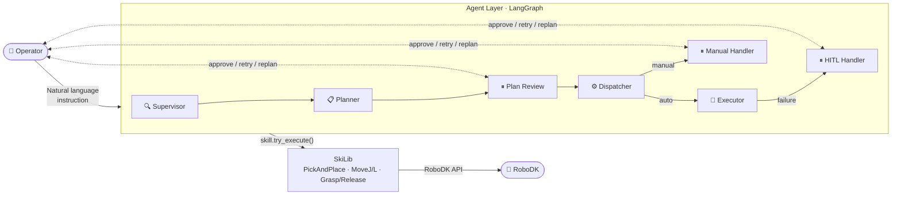
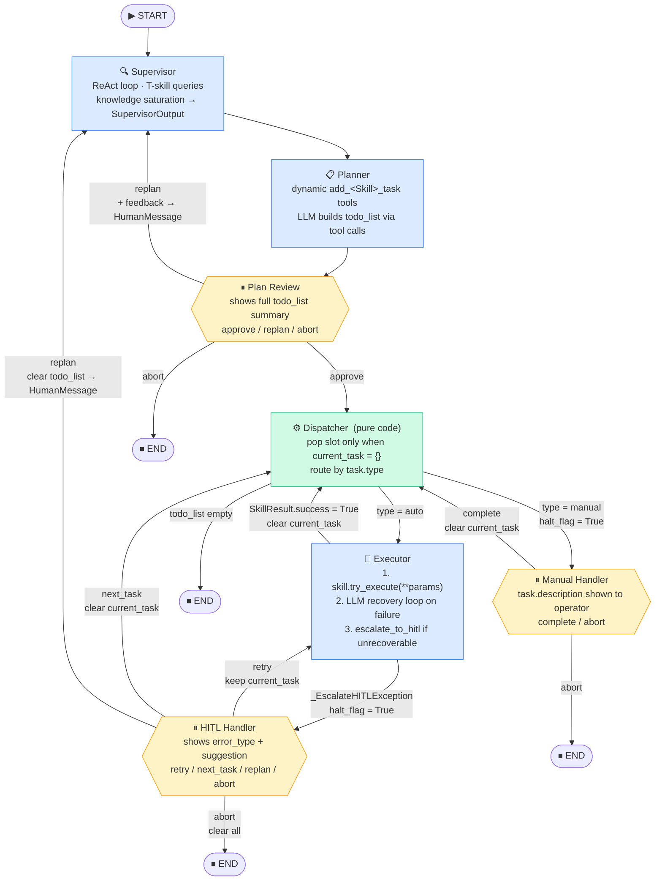
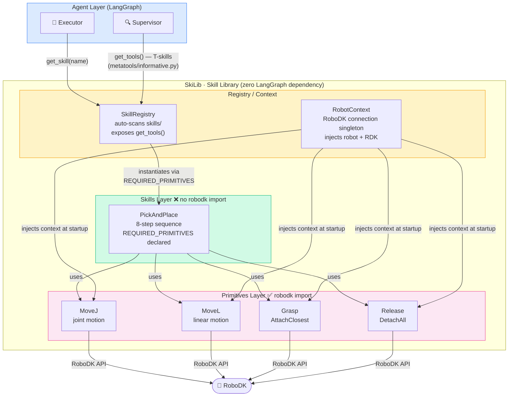
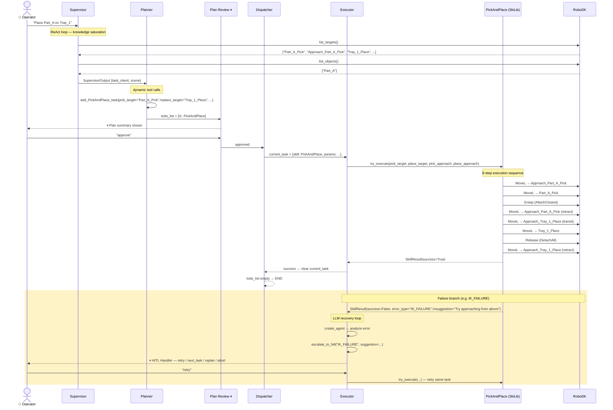

# RoboSkiAgent — Architecture Diagrams

> Last updated: 2026-03-30 (rewritten to reflect Phase 6 production code)
>
> Four levels of detail — use the level that matches your audience.

---

## Level 1 · System Overview

High-level: what the system receives, what it produces, who is involved.



---

## Level 2 · LangGraph State Machine

All nodes, edges, and HITL interrupt gates (⏸ = `langgraph.interrupt()`).



---

## Level 3 · SkiLib Internal Layers

Dependency flow from Agent down to RoboDK API calls.



---

## Level 4 · Single Task Execution Sequence

End-to-end trace for one `PickAndPlace` task, including failure/recovery branch.



---

## GlobalState Field Map

Which node reads / writes each field.

```mermaid
flowchart LR
    subgraph STATE["GlobalState (LangGraph shared state)"]
        direction TB
        MSG["messages\nAnnotated append-only"]
        TODO["todo_list"]
        CUR["current_task\nexecution slot: {} = idle"]
        LAST["last_result: SkillResult"]
        HALT["halt_flag: bool"]
        HR["halt_reason"]
        LOG["execution_log\nAnnotated append-only"]
    end

    SUP["Supervisor"] -->|write AIMessage| MSG
    PLAN["Planner"] -->|write| TODO
    PLAN -->|write| LOG

    DISP["Dispatcher"] -->|pop → write| CUR
    DISP -->|update| TODO
    DISP -->|manual: set True| HALT
    DISP -->|manual: MANUAL_TASK| HR
    DISP -->|write| LOG

    EXE["Executor"] -->|write| LAST
    EXE -->|success: clear {}| CUR
    EXE -->|failure: set True| HALT
    EXE -->|failure: TASK_FAILURE| HR
    EXE -->|write| LOG

    HH["HITL Handler\nManual Handler"] -->|clear False| HALT
    HH -->|clear None| HR
    HH -->|"complete/abort: clear {}"| CUR
    HH -->|abort: clear| TODO
    HH -->|write| LOG
    HH -->|replan: write HumanMessage| MSG
```
