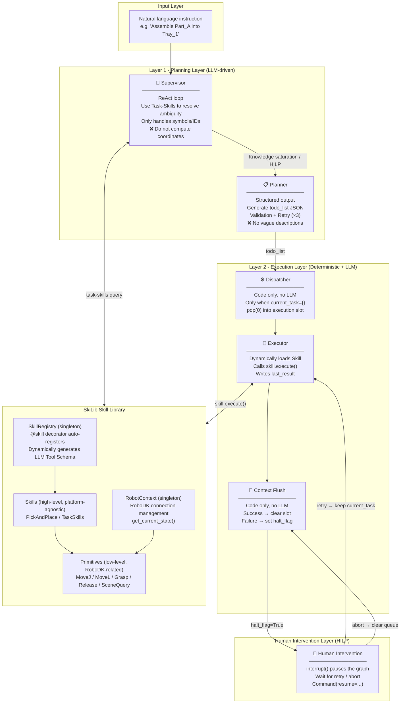
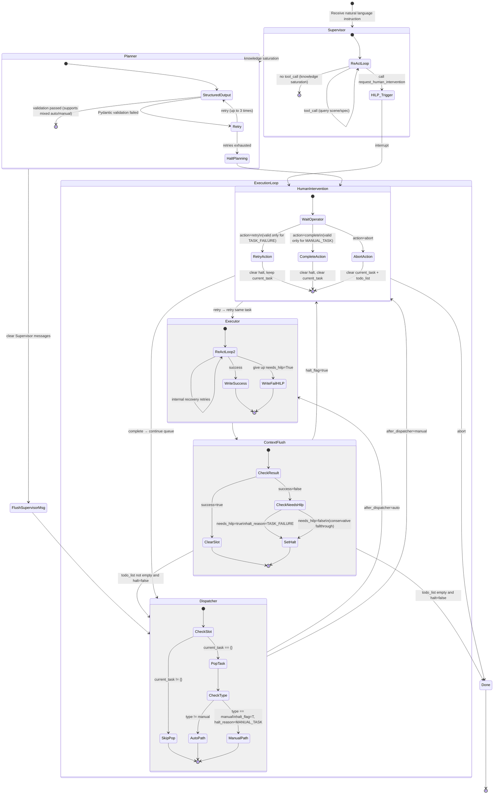
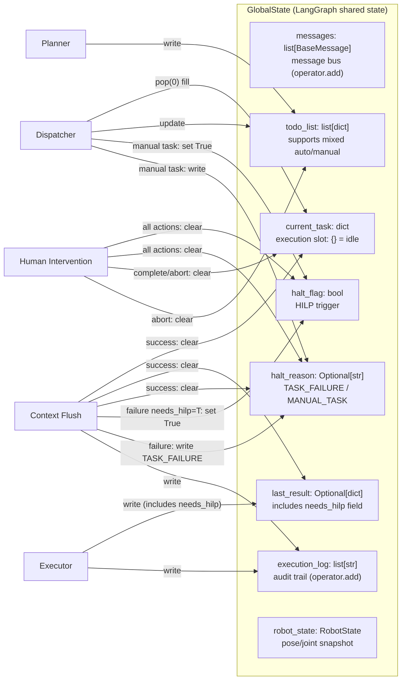
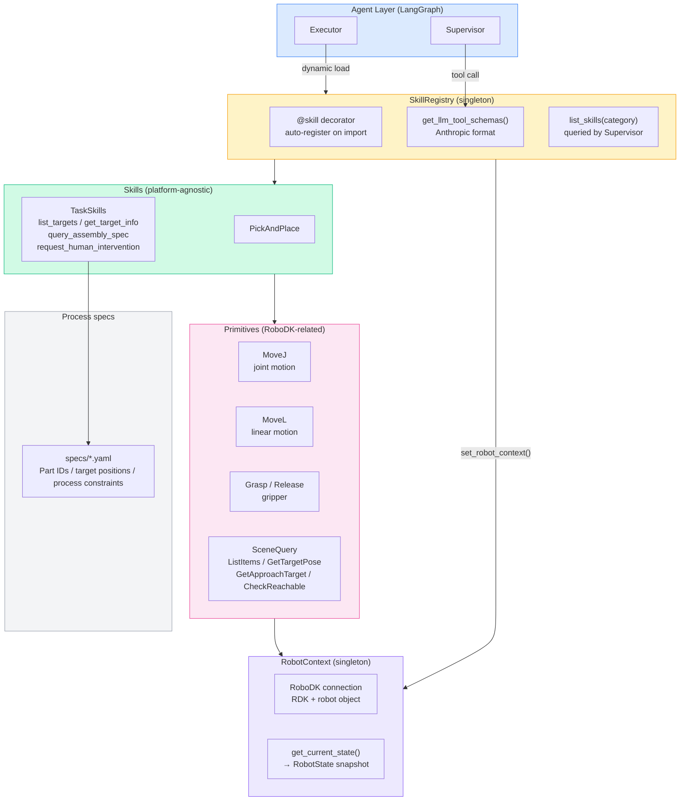
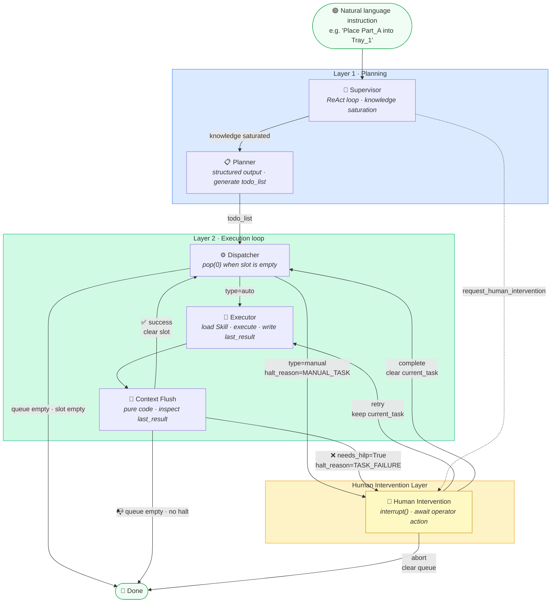
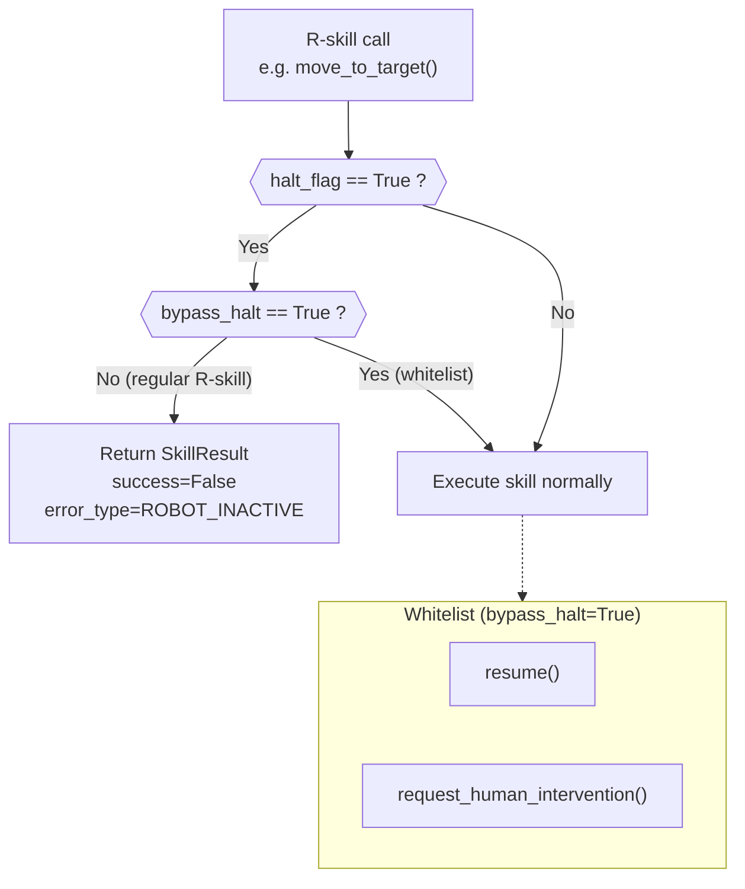

# RoboSkiAgent 架构图与控制流图

---

## 1. 系统整体分层架构

---

## 2. Agent 控制流状态机

> [2026-03-13 更新] 新增 manual 任务路径（Dispatcher → HumanIntervention）、needs_hilp 检查、`complete` 动作

---

## 3. GlobalState 数据流

> [2026-03-13 更新] 新增 `halt_reason`、`_hi_action`；完善各节点写入路径

---

## 4. SkiLib 组件架构

---

## 5. 执行槽（current_task）生命周期

> [2026-03-13 更新] 新增 ManualPending 状态和 complete 转换

```mermaid
stateDiagram-v2
    [*] --> Empty : initialized

    Empty : current_task = {}
    AutoOccupied : current_task = {type=auto, skill, params}
    ManualPending : current_task = {type=manual, description}\nhalt_flag=T, halt_reason=MANUAL_TASK
    Failed : current_task retained (unchanged)\nhalt_flag=T, halt_reason=TASK_FAILURE

    Empty --> AutoOccupied : Dispatcher.pop(0) type=auto
    Empty --> ManualPending : Dispatcher.pop(0) type=manual
    AutoOccupied --> Empty : Context Flush (success=True)
    AutoOccupied --> Failed : Context Flush (needs_hilp=True)
    Failed --> AutoOccupied : Human Intervention action=retry\n(clear halt, keep slot)
    Failed --> Empty : Human Intervention action=abort
    ManualPending --> Empty : Human Intervention action=complete\n(clear halt, clear slot)
    ManualPending --> Empty : Human Intervention action=abort

    note right of Empty : Dispatcher fills a new task only when slot is {}
    note right of Failed : Dispatcher skips non-empty slot and does not overwrite
    note right of ManualPending : Executor is bypassed; wait directly for operator
```

---

## 6. Agent 高层控制流（概览）

> 展示从自然语言指令到任务完成的完整主路径，以及 HILP 挂起与恢复的关键分支。
> 省略节点内部细节（ReAct 循环、retry 逻辑等），聚焦于**节点间的路由决策**。

---

## 7. @require_robot_active 守卫机制

