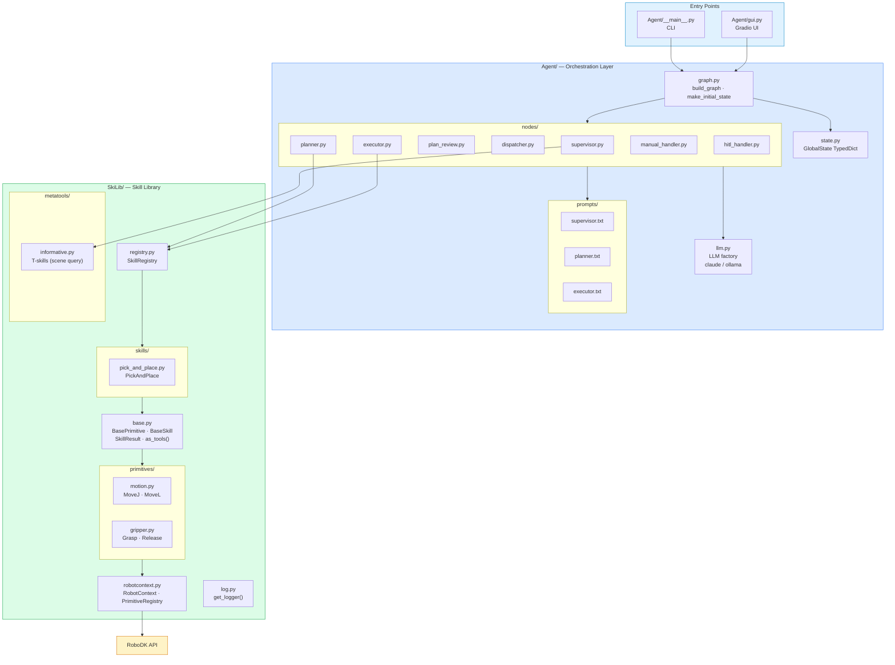

# RoboSkiAgent — Codebase Architecture

```mermaid
flowchart TD
    subgraph Entry ["Entry Points"]
        CLI["Agent/__main__.py\nCLI"]
        GUI["Agent/gui.py\nGradio UI"]
    end

    subgraph AgentPkg ["Agent/  — Orchestration Layer"]
        direction TB
        GRAPH["graph.py\nbuild_graph · make_initial_state"]
        STATE["state.py\nGlobalState TypedDict"]

        subgraph Nodes ["nodes/"]
            N1["supervisor.py"]
            N2["planner.py"]
            N3["plan_review.py"]
            N4["dispatcher.py"]
            N5["executor.py"]
            N6["manual_handler.py"]
            N7["hitl_handler.py"]
        end

        subgraph Prompts ["prompts/"]
            P1["supervisor.txt"]
            P2["planner.txt"]
            P3["executor.txt"]
        end

        LLM["llm.py\nLLM factory\nclaude / ollama"]
    end

    subgraph SkiLibPkg ["SkiLib/  — Skill Library"]
        direction TB
        BASE["base.py\nBasePrimitive · BaseSkill\nSkillResult · as_tools()"]
        REG["registry.py\nSkillRegistry"]
        CTX["robotcontext.py\nRobotContext · PrimitiveRegistry"]
        LOG["log.py\nget_logger()"]

        subgraph Prims ["primitives/"]
            MJ["motion.py\nMoveJ · MoveL"]
            GR["gripper.py\nGrasp · Release"]
        end

        subgraph Skills ["skills/"]
            PP["pick_and_place.py\nPickAndPlace"]
        end

        subgraph Meta ["metatools/"]
            INF["informative.py\nT-skills (scene query)"]
        end
    end

    RDK["RoboDK API"]

    CLI --> GRAPH
    GUI --> GRAPH
    GRAPH --> STATE
    GRAPH --> Nodes
    Nodes --> LLM
    Nodes --> Prompts
    N1 --> INF
    N2 --> REG
    N5 --> REG

    REG --> Skills
    Skills --> BASE
    BASE --> Prims
    Prims --> CTX
    CTX --> RDK

    style Entry    fill:#e0f2fe,stroke:#0284c7
    style AgentPkg fill:#dbeafe,stroke:#3b82f6
    style SkiLibPkg fill:#dcfce7,stroke:#16a34a
    style RDK      fill:#fef3c7,stroke:#d97706
```
