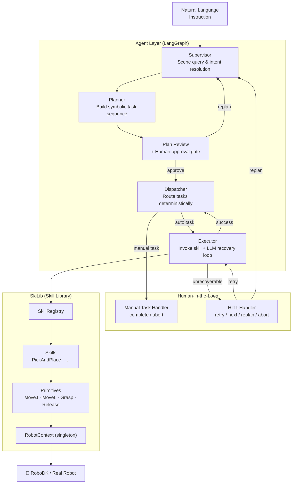
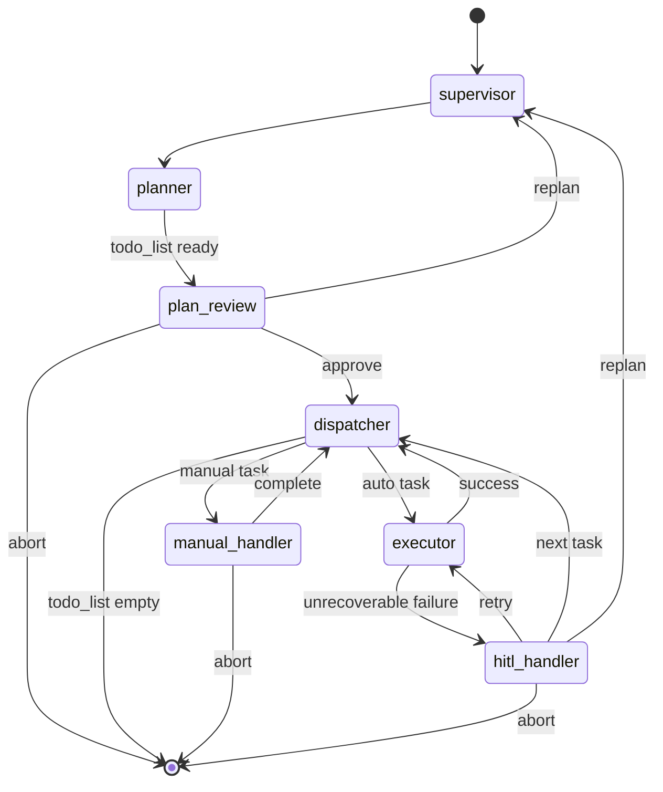
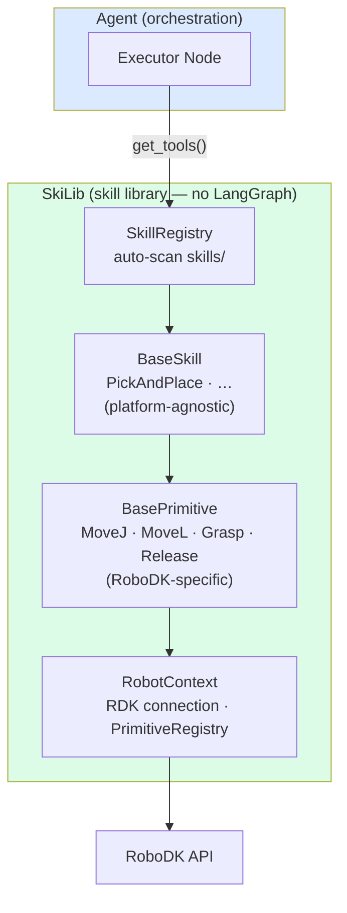
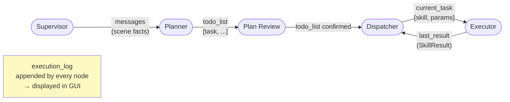
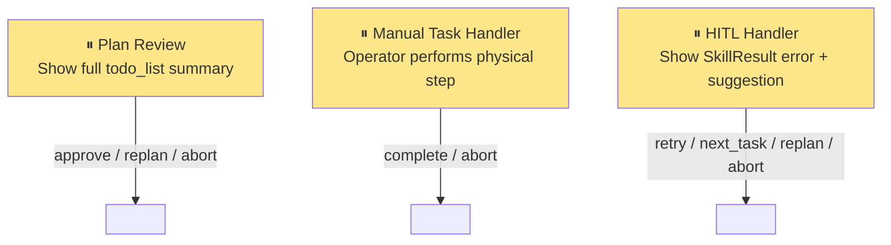

# RoboSkiAgent — Architecture Diagrams

---

## 1. System Overview

High-level view: from natural language to robot action.

---

## 2. Agent Graph (LangGraph Nodes & Edges)

State machine inside the Agent layer.

---

## 3. SkiLib Layer Structure

Dependency direction is strictly top-down; no upward imports.

---

## 4. Global State & Data Flow

How `GlobalState` fields move through the pipeline.

---

## 5. HITL Interrupt Points

Where the system pauses and waits for the human operator.

